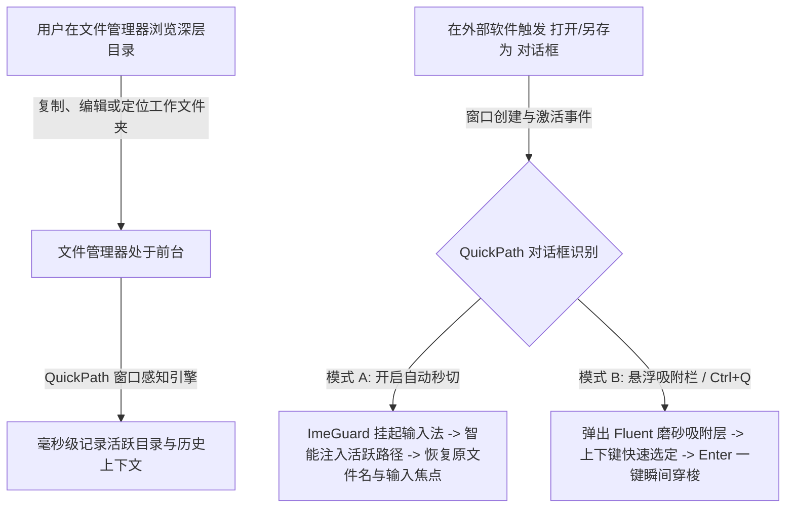

# QuickPath 详细使用说明书与操作指南

<div align="center">

**简体中文** | [English Manual](User_Manual_EN.md) · [返回项目主页](../README_CN.md)

[](#)
[](https://microsoft.com)
[](https://qp.yftec.top)
[](../LICENSE)

**现代 Fluent 风格 · 文件对话框智能路径跟随与快速跳转利器**

[🌐 官方网站](https://qp.yftec.top) · [🐙 GitHub 仓库](https://github.com/clhome/QuickPath) · [💬 提交反馈与建议](https://github.com/clhome/QuickPath/issues)

</div>

---

## 目录

- [1. 产品概述与工作原理](#1-产品概述与工作原理)
- [2. 系统要求与运行环境](#2-系统要求与运行环境)
- [3. 安装与启动方式](#3-安装与启动方式)
- [4. 核心功能操作详解](#4-核心功能操作详解)
  - [4.1 智能自动秒切 (AutoSwitch)](#41-智能自动秒切-autoswitch)
  - [4.2 现代 Fluent 悬浮吸附条 (Floating Bar)](#42-现代-fluent-悬浮吸附条-floating-bar)
  - [4.3 输入法隔离与智能文件名保护 (ImeGuard)](#43-输入法隔离与智能文件名保护-imeguard)
  - [4.4 全生态文件管理器联动适配](#44-全生态文件管理器联动适配)
  - [4.5 任务栏硬件状态监控模块 (Ver 1.1.0 之后新增)](#45-任务栏硬件状态监控模块-ver-110-之后新增)
- [5. 图形化设置中心操作手册](#5-图形化设置中心操作手册)
  - [5.1 如何打开设置中心](#51-如何打开设置中心)
  - [5.2 各项配置功能详解](#52-各项配置功能详解)
  - [5.3 设置草稿与保存生效机制](#53-设置草稿与保存生效机制)
- [6. 配置文件与进阶定制](#6-配置文件与进阶定制)
  - [6.1 配置文件格式说明](#61-配置文件格式说明)
  - [6.2 进程黑名单策略](#62-进程黑名单策略)
  - [6.3 第三方自定义语言包扩展](#63-第三方自定义语言包扩展)
- [7. 常见问题排查 (FAQ)](#7-常见问题排查-faq)
- [8. 出品方与开源许可](#8-出品方与开源许可)

---

## 1. 产品概述与工作原理

### 1.1 背景痛点
在桌面日常工作流中，重度电脑用户（如程序员、设计师、视频创作者、办公文档处理人员）频繁穿梭于**“文件管理器（如 Explorer、Directory Opus）”**与**各类软件的“打开 / 另存为文件对话框”**之间。

传统的交互痛点：
1. 刚刚在文件管理器中定位到了层级极深的工程目录，但在 IDE 或软件中点击“保存”或“打开”时，弹出的对话框却往往停留在上次使用或默认的“下载/文档”目录；
2. 用户不得不重复在对话框左侧树形结构中层层展开点选，或者手动复制文件管理器地址栏路径再粘贴到对话框中；
3. 使用传统的脚本或辅助工具时，路径注入容易受中文输入法拼音顶词干扰，导致路径错乱甚至将原有敲好的文件名暴力抹掉。

### 1.2 解决方案与工作原理
**QuickPath** 专为消除上述割裂感而生，通过系统级 WinEvent 监听与精准句柄识别，构建了毫秒级响应的智能路径同步流水线：



---

## 2. 系统要求与运行环境

| 项目 | 最低要求 / 推荐规范 |
| :--- | :--- |
| **操作系统** | Windows 10 (版本 1809 及以上) / Windows 11 (全版本，全面支持多标签页) |
| **体系架构** | x86_64 (64位) |
| **依赖环境** | 纯原生 Rust 独立编译，**零运行时依赖**（无需安装 .NET、VC++ Redistributable 或 Python） |
| **可执行体积** | 约 **1.2 MB**（包含全套内嵌高分辨率品牌图标与双语国际化包） |
| **系统资源占用** | 常驻后台内存 **< 10 MB**（启用状态监控模块时增量常驻内存 $\le 5\text{ MB}$），静默待机状态 CPU 占用 **0%**（状态监控模块后台 Worker 采样增量 CPU $\le 0.05\%$；关闭模块时完全退出后台线程并释放句柄，达到 0 开销） |
| **高分屏与多屏** | 原生支持 Per-Monitor V2 DPI 动态感知，完美适配 100%、125%、150%、175%、200% 混合缩放 |

---

## 3. 安装与启动方式

### 3.1 绿色便携使用
QuickPath 为完全绿色的免安装单文件应用程序：
1. 将下载的 `quickpath.exe` 解压放置到你喜爱的任意目录（如 `D:\Tools\QuickPath\` 或便携 U 盘）；
2. 双击 `quickpath.exe` 即可在后台静默启动；
3. 启动后，屏幕右下角任务栏通知区域将出现 QuickPath 的专属托盘图标。

### 3.2 配置文件存储策略（双模式）
- **便携模式 (Portable Mode)**：若程序同级目录下存在 `quickpath.json`，QuickPath 将自动切换为绿色便携存储，所有修改与状态均保存在本地目录中；
- **标准安装模式 (Standard Mode)**：若同级目录未发现该文件，配置将默认保存在系统当前用户的 `%APPDATA%\QuickPath\config.json` 中。

### 3.3 开机静默自启（免 UAC 弹窗）
- QuickPath 内置通过 **Windows 任务计划程序 (Task Scheduler)** 注册开机启动项；
- 通过该机制，程序开机时将以当前用户的最高可用权限静默启动，**开机不弹出任何黄色 UAC 确认弹窗**；
- 同时，具备高权限的 QuickPath 可以与同样以管理员权限运行的专业开发软件（如 Visual Studio、Elevated Terminal、IDA Pro 等）的文件对话框无障碍通信。

---

## 4. 核心功能操作详解

### 4.1 智能自动秒切 (AutoSwitch)
- **功能描述**：
  当你刚从文件管理器（如资源管理器、Directory Opus）切入到某个软件并弹出“打开”或“另存为”对话框时，系统自动识别出两者的切换关联，瞬间将文件对话框内部的目录切换为您刚刚查看的文件夹。
- **配置与调优**：
  - 在设置中心可随时开关此功能；
  - **触发延时 (ms)**：默认为 `80ms`。若部分老旧软件在对话框刚刚创建时内部控件渲染较慢，可适当调大至 `120ms` ~ `150ms`；若追求极致秒开，可保持在 `60ms` ~ `80ms`。
- **安全防冲刷机制**：
  如果用户已经开始在对话框中点选了其他目录，或者已输入定制路径，QuickPath 将自动进行防误触锁止，绝不暴力覆盖已修改的路径。

### 4.2 现代 Fluent 悬浮吸附条 (Floating Bar)
- **视觉特性**：
  采用 Windows 11 原生 Mica / 亚克力（Acrylic）磨砂材质与精致平滑圆角，具备多级半透明度调节（40% ~ 100%）。
- **呼出与吸附**：
  - 对话框弹出时，悬浮栏会精准贴合在对话框边缘（支持左边缘/右边缘/上边缘自适应计算，且严格限制在当前物理显示器可视区域内）；
  - 默认快捷键：**`Ctrl + Q`**（可在设置中心任意自定义录制）。
- **单行高密度候选列表**：
  候选条目采用统一单行紧凑排布：
  ```
  📁 [文件夹名称]      D:\Work\Projects\QuickPath      [来源徽章: 活动/历史/收藏]
  ```
  最多呈现 8 条近期相关候选项，视觉一目了然。
- **极速键盘盲打控制**：
  - `↑` / `↓`：在候选列表中切换高亮选中项目；
  - `Enter`：确认并将选中的路径毫秒级注入到当前对话框中瞬时跳转；
  - `Esc`：快速关闭悬浮条；
  - 顶栏右侧展示出品方标识并支持直接点击直达官方主页。

### 4.3 输入法隔离与智能文件名保护 (ImeGuard)
- **输入法免打扰 (ImeGuard)**：
  在向 Win32 文件名或地址栏控件进行消息通讯时，QuickPath 会在微秒级时间内暂时挂起当前线程的输入法候选窗口，注入完毕后即刻恢复。杜绝了因为输入法处于中文拼音状态而把路径字母打成一长串拼音候选词的问题；
- **智能文件名保护**：
  在“另存为”场景下，若您已经提前在文件名框中输入好了自定义文件名（如 `Report_Final.pdf`），QuickPath 会智能分离目录与文件名，仅执行目录跳转，**绝对不会将您的文件名清空或覆盖成路径**。

### 4.4 全生态文件管理器联动适配

| 文件管理器 | 适配原理与特性说明 |
| :--- | :--- |
| **Windows 11 资源管理器** | 原生适配 **多标签页 (Tabs)**。突破传统 COM 无法识别活动 Tab 的限制，精准感知当前处于前台高亮的标签页目录 |
| **Windows 10 资源管理器** | 深度支持标准 `CabinetWClass` 单窗口极速枚举 |
| **Directory Opus (DOpus)** | 通过 `dopusrt` 命令行桥接，毫秒级提取活动 Lister 与窗格真实路径 |
| **Total Commander (TC)** | 左右窗格自适应感知，通过标准消息管道提取路径，并在操作完毕后无损还原用户剪贴板 |
| **XYplorer** | 采用 `WM_COPYDATA` 自动化脚本交互协议，实时捕获当前激活 Tab |

### 4.5 任务栏硬件状态监控模块 (Ver 1.1.0 之后新增)

#### 4.5.1 模块定位与免特权轻量设计
作为 QuickPath 的**内置可选扩展模块**（默认启用，支持在设置中心或托盘菜单中彻底停用），为桌面用户提供极简、低开销、高可靠的 Windows 原生任务栏硬件状态看板：
- **免特权官方 API**：严格基于 Windows 官方用户态 API（IP Helper API `GetIfTable2`、`GetSystemTimes`、`GlobalMemoryStatusEx`、PDH 性能计数器、DXGI `IDXGIAdapter3`），杜绝任何 Ring 0 内核驱动注入与稳定性隐患；
- **极限轻量，零冗余开销**：模块启用状态下增量常驻内存 $\le 5\text{ MB}$（全局进程 Working Set 保持在 $15\sim 20\text{ MB}$ 内），增量 CPU 占用 $\le 0.05\%$；**停用时完全退出后台采样 Worker 线程并释放系统句柄，达到绝对 0% CPU 与 0 MB 增量开销**。

#### 4.5.2 常驻两行面板布局与极清渲染
采用高密度两行紧凑栅格布局（默认自适应任务栏高度 32~40px，窗口宽度随指标项 ~40px 到 ~130px 动态平滑自适应）：

```text
┌───────────────────────────────────────────┐
│  ↑  1.2     C: 19%    G: 32%              │  <- 第一行：上传 Mbps (隐藏单位) | CPU% (微条) | GPU%
│  ↓  3.5     M: 42%    D:  3%              │  <- 第二行：下载 Mbps (隐藏单位) | 内存% (微条) | 磁盘吞吐
└───────────────────────────────────────────┘
```

- **网速数值精简对齐**：统一换算为比特单位 `Mbps` 并省略单位文字后缀，仅保留方向前缀 `↑` 与 `↓`。速率 $< 100$ 时保留 1 位小数，速率 $\ge 100$ 时按整数显示，节省近 40% 任务栏空间；
- **动态列自适应收缩引擎**：指标按逻辑编排为 3 个逻辑列（网络列、CPU/内存列、GPU/磁盘列）。当某列指标均未勾选时完全剔除不占任何像素，面板宽度动态自适应收缩；
- **微型指示条与三档动态分级着色**：CPU 与内存数值下方自绘 2px 动态微条。CMGD 四大核心指标（CPU、内存、GPU、磁盘）数值文字支持根据当前利用率三档变色警示：`< 70%` 鲜绿色，`70% ~ 85%` 亮黄色，`> 85%` 鲜红色；
- **沉稳深色背景与 Win32 ClearType 锐利渲染**：采用 `Microsoft YaHei UI`（微软雅黑）字体配合 ClearType 原生抗锯齿，结合平滑 Alpha 通道保护，底色沉稳纯净，杜绝复杂壁纸杂色穿透与文字灰边毛刺；
- **实时历史波形折线图背景**：支持在指标文字后方渲染 15~20 秒滑动历史波形折线（采样间隔 1000ms，环形缓冲区），直观捕捉系统短期波动；
- **三档采样刷新频率**：提供 1.0 秒、3.0 秒（系统默认推荐）、5.0 秒三档自由选择。

#### 4.5.3 双停靠位置模式 (Dock Position)
支持在设置中心或右键菜单中随时切换停靠位置：
1. **任务栏右侧 (TrayLeft，默认)**：紧靠系统右下角托盘通知区域左边缘无缝吸附；
2. **任务栏左上方独立悬浮 (TaskbarLeft)**：独立悬浮停靠在任务栏左侧上边缘正上方（距任务栏顶边留出间距），与底部运行中的应用程序标签栏目形成物理隔离，从根本上杜绝覆盖或干扰任务栏应用按钮。

#### 4.5.4 全屏应用主动隐匿避让 (Full-screen Auto-hide)
专为游戏玩家与演示场景深度打造的防遮挡避让机制：
- 后台周期性感知前台窗口状态，当检测到前台窗口处于全屏游戏、全屏视频播放或全屏演示（非桌面窗口且分辨率覆盖全屏）时，监控面板立即调用 `ShowWindow(SW_HIDE)` 主动隐匿；
- 当切回普通窗口或桌面时，面板即刻平滑恢复展示；
- 完美协同 Windows 任务栏“自动隐藏”模式，跟随任务栏滑入滑出同步联动。

#### 4.5.5 Fluent 极清硬件详情看板 (Tooltip)
当鼠标悬停在常驻监控面板超过 400ms 时，自动弹出 Fluent 视觉规范的深色详情看板（Microsoft YaHei UI 极清排版，宽度与高度自适应内容不截断）：
- **实时网速与网卡**：还原展示完整双重计量单位（Mbps 与 MB/s），展示物理网卡真实名称（多层精准过滤虚拟与回环网卡，支持 Docker/WSL/VMware/VPN 场景）；
- **处理器 (CPU)**：展示总占用率，以及秒级缓存比对提取的资源消耗最高的 **Top 1 进程名称与占比**；
- **物理内存 (RAM)**：展示利用率与精确已用/总容量（如 `已用 13.4 GB / 共 32.0 GB`）；
- **独立显卡 (GPU)**：综合利用率与**专有物理显存 (Dedicated VRAM)** 占用与总量（如 `3.8 GB / 8.0 GB`，严格剔除操作系统虚高的共享显存配额）；
- **磁盘 I/O**：展示实时读取吞吐率与写入吞吐率（MB/s）；
- **系统连续运行时间**：基于 `GetTickCount64` 计算真实启动时长，不受 Windows 10/11“快速启动”假关机欺骗；
- **供电状态**：读取电池电量百分比、交流电接通或电池供电状态；
- **出品方与官网直达**：看板顶栏右侧展示出品方标识，点击可直接跳转官网，并支持鼠标从监控条平滑无缝移入看板进行交互。

#### 4.5.6 鼠标与交互快捷操作
- **左键双击**：调用系统 `ShellExecuteW` 极速唤起 Windows 任务管理器（`taskmgr.exe`）；
- **右键单击**：弹出原生上下文菜单，提供以下快捷操作：
  - `打开 QuickPath 设置中心...`（直达任务栏监控设置标签页）
  - `显示指标`（独立勾选/取消：网络吞吐、CPU、RAM、GPU、Disk）
  - `显示历史波动背景图`（快捷开关）
  - `停靠位置`（切换任务栏右侧 / 任务栏左上方独立悬浮）
  - `刷新网络适配器`（网络环境变化时手动刷新）
  - `隐藏此监控面板`（关闭展示）
  - `退出 QuickPath`
- **托盘菜单集成**：系统右下角托盘图标右键菜单中包含快捷切换开关，随时一键重开或关闭监控。

---

## 5. 图形化设置中心操作手册

### 5.1 如何打开设置中心
- **鼠标操作**：在桌面右下角系统托盘区，**单击** 或 **双击** QuickPath 图标；
- **菜单操作**：在托盘图标上 **右键单击**，在弹出的上下文菜单中选择 **“⚙️ 设置中心 (Settings)”**。

### 5.2 各项配置功能详解

设置中心采用现代 Fluent 双选项卡卡片式布局（可在顶部自由切换「常规偏好」与「任务栏监控」选项卡）：

#### 「常规偏好」选项卡
1. **自动秒切 (AutoSwitch)**
   - **现代 Toggle 开关**：点击或左右拖动滑块即可启用/关闭自动同步；
   - **响应延迟**：微调毫秒级延时，平衡响应敏捷性与程序稳定性。
2. **悬浮条外观 (Floating Bar)**
   - **自绘透明度滑块 (Opacity Slider)**：可在 **40% 到 100%** 之间按像素平滑拖动调节；
   - 拖动时实时显示当前百分比数值，设置生效后吸附层呈现极具现代科技感的亚克力毛玻璃视觉。
3. **全局呼出快捷键 (Hotkey)**
   - 界面直观展示当前热键徽章（如 `Ctrl + Q`）；
   - **点击卡片进入按键录制模式**：界面提示“请按下快捷键组合...”，支持直接按下任意键盘组合（如 `Ctrl + Shift + F`、`Alt + D`、`Win + Q` 等）；
   - 若想放弃本次录制，按 `Esc` 即可恢复；
   - 确定保存后，全局热键将动态重新注册生效，无需重启程序。
4. **开机自启动 (AutoStart)**
   - 开启后自动在 Windows 计划任务中创建免 UAC 启动任务；
   - 保证系统重启后无缝静默驻留后台。
5. **界面语言切换 (Language)**
   - 采用自绘下拉框（Dropdown）与原生菜单；
   - 随时在 **简体中文 (zh-CN)** 与 **English (en-US)** 之间无缝切换；
   - 全局界面（设置面板、托盘右键菜单、悬浮栏文本、提示信息）即时更新。
6. **关于板块 (About QuickPath)**
   - 界面左侧展示 80% 高清重采样的 QuickPath 官方 Logo；
   - 右侧展示产品定位、版本号、出品方“衢州御风科技有限公司”；
   - 提供官方网站链接（[https://qp.yftec.top](https://qp.yftec.top)）与 GitHub 开源仓库入口（[https://github.com/clhome/QuickPath](https://github.com/clhome/QuickPath)），鼠标悬停高亮，点击即可用默认浏览器打开。

#### 「任务栏监控」选项卡 (Ver 1.1.0 之后新增)

1. **状态监控总开关**：一键启用或彻底停用任务栏硬件监控模块。停用时后台采集线程完全退出，零额外资源消耗；
2. **任务栏停靠位置**：提供单选切换：
   - **任务栏右侧 (默认)**：停靠在任务栏托盘通知区左侧；
   - **任务栏左上方 (独立悬浮)**：独立悬浮在任务栏左侧正上方，彻底解决覆盖应用程序标签栏的问题；
3. **常驻监控指标细粒度多选**：五个独立复选框，可按需任意勾选组合：
   - 网络吞吐（上传/下载）
   - 处理器利用率 (CPU)
   - 物理内存利用率 (RAM)
   - 显卡利用率 (GPU)
   - 磁盘吞吐利用率 (Disk)
   面板宽度将根据勾选列数自适应平滑收缩；
4. **外观与采样参数**：
   - **显示实时历史波形背景**：开关 15~20 秒折线波动背景图；
   - **采样刷新频率**：现代 Fluent 胶囊单选组件，支持 `1.0 秒`、`3.0 秒 (推荐)` 与 `5.0 秒` 三档切换；
   - **监控面板透明度滑块**：自绘滑块可在 `50%` 至 `100%` 之间平滑拖动调节背景通透度。

### 5.3 设置草稿与保存生效机制
- **草稿保护模式**：在设置中心调整任何滑块、开关或快捷键时，均为临时草稿状态；
- **点击「确定」**：将全部新设置持久化写入配置文件、热更新内存中的全局 `AppState`、同步计划任务并关闭窗口；
- **点击「取消」或右上角关闭**：彻底丢弃未保存的修改，恢复之前的运行配置。

---

## 6. 配置文件与进阶定制

### 6.1 配置文件格式说明
QuickPath 使用标准的 JSON 格式存储配置，字段结构如下：

```json
{
  "auto_switch_enabled": true,
  "auto_switch_delay_ms": 80,
  "hotkey": "Ctrl+Q",
  "floating_bar_enabled": true,
  "floating_bar_auto_show": false,
  "floating_bar_opacity": 90,
  "autostart_enabled": false,
  "autostart_task_scheduler": true,
  "language": "zh-CN",
  "blacklist_processes": [
    "chrome.exe",
    "msedge.exe",
    "firefox.exe",
    "brave.exe"
  ],
  "pinned_folders": [
    "D:\\Projects",
    "C:\\Users\\Public\\Downloads"
  ],
  "history_folders": [],
  "monitor": {
    "enabled": true,
    "position": "TrayLeft",
    "show_network": true,
    "show_cpu": true,
    "show_memory": true,
    "show_gpu": true,
    "show_disk": true,
    "show_graph_bg": true,
    "refresh_interval_ms": 3000,
    "opacity": 95
  }
}
```

#### 任务栏硬件监控配置项明细 (Ver 1.1.0 之后新增)
| 字段项 | 类型 | 默认值 | 作用说明 |
| :--- | :--- | :--- | :--- |
| `enabled` | 布尔值 | `true` | 任务栏硬件状态监控总开关（关闭时完全退出后台 Worker 线程，零资源消耗） |
| `position` | 字符串 | `"TrayLeft"` | 停靠位置模式：`"TrayLeft"`（任务栏右侧默认）或 `"TaskbarLeft"`（任务栏左上方独立悬浮） |
| `show_network` | 布尔值 | `true` | 是否展示网络实时吞吐（第一行上传、第二行下载） |
| `show_cpu` | 布尔值 | `true` | 是否展示处理器利用率 (CPU) 与微型指示条 |
| `show_memory` | 布尔值 | `true` | 是否展示物理内存利用率 (RAM) 与微型指示条 |
| `show_gpu` | 布尔值 | `true` | 是否展示独立显卡利用率 (GPU) |
| `show_disk` | 布尔值 | `true` | 是否展示磁盘 I/O 活动利用率 (Disk) |
| `show_graph_bg` | 布尔值 | `true` | 是否在文字后方渲染 15~20 秒历史波动折线图 |
| `refresh_interval_ms` | 整数 | `3000` | 采样刷新频率（毫秒，支持 1000 / 3000 / 5000） |
| `opacity` | 整数 | `95` | 监控面板背景半透明度（50 ~ 100） |

### 6.2 进程黑名单策略 (`blacklist_processes`)
在某些场景下，用户可能不希望某些程序自动触发路径秒切。例如：
- 浏览器（Chrome、Edge、Firefox）：在保存网页图片或下载文件时，很多用户习惯保存在固定的默认下载目录；
- 您只需在 `blacklist_processes` 数组中添加对应的进程文件名（小写，如 `"notepad.exe"`），QuickPath 在检测到该进程弹出的对话框时就会自动静音跳过自动秒切，但依然允许您通过快捷键手动呼出悬浮栏。

### 6.3 第三方自定义语言包扩展
QuickPath 内置了中英文语言包，同时支持无缝扩展任意语言：
1. 在程序所在同级目录创建 `locales/` 文件夹；
2. 放入新的 TOML 语言包（例如 `locales/ja-JP.toml` 或 `locales/fr-FR.toml`）；
3. 参考内置 `zh-CN.toml` 的键值结构进行翻译；
4. 重新打开设置中心，下拉菜单中将自动出现新语言项供选择！

---

## 7. 常见问题排查 (FAQ)

### Q1: 某些软件打开文件对话框时，没有自动跳转？
- **排查 1（管理员权限隔离）**：如果该软件是以“管理员身份运行”启动的，而 QuickPath 是以普通权限运行，Windows 的 UIPI（用户界面特权隔离）机制会阻止普通权限进程与高权限窗口通讯。**解决方法**：在设置中心开启“开机自启”，或右键以管理员身份重新运行 QuickPath。
- **排查 2（黑名单过滤）**：检查该软件进程名是否被包含在 `config.json` 的 `blacklist_processes` 中。
- **排查 3（延迟时序）**：在设置中心将“响应延时”从 `80ms` 适当调高至 `120ms`。

### Q2: 自定义快捷键无法使用或提示冲突？
- 如果录制的快捷键已被系统或其他全局热键工具（如 QQ、微信热键、PowerToys）占用，Windows 会拒绝注册该热键。请在设置中心重新录制一组不冲突的组合键（如 `Ctrl + Alt + Q` 或 `Win + Q`）。

### Q3: 悬浮吸附条在多显示器环境下位置偏移？
- QuickPath 专为高分屏与混合 DPI（例如 4K 200% 主屏 + 1080P 100% 副屏）开发了动态 DPI 感知引擎。无论对话框被拖至哪个屏幕，悬浮栏均会自动按目标物理屏幕的工作区重新计算缩放和边界，确保不会溢出屏幕边缘。

### Q4: 杀毒软件提示报毒或拦截？
- QuickPath 完全使用 Rust 编写，无任何流氓行为、后门或广告弹窗。由于程序需要监听系统窗口事件（`SetWinEventHook`）与注册热键，极少数严格的第三方杀毒软件可能产生启发式误报。本项目完全开源透明，请放心将其加入信任白名单。

### Q5: 全屏玩游戏、全屏播放视频或演示 PPT 时，监控条为什么会自动消失？*(Ver 1.1.0 之后新增)*
- **解答**：这是 QuickPath 为保护沉浸式体验特别设计的“全屏主动隐匿避让机制”。当检测到前台窗口处于全屏分辨率（如全屏 3D 游戏、全屏影音、PowerPoint 放映等）时，监控面板会自动调用静默隐藏，绝不遮挡游戏画面与字幕；一旦切回普通桌面或窗口，面板将无缝恢复展示。

### Q6: 为什么常驻监控面板的网速没有显示单位？*(Ver 1.1.0 之后新增)*
- **解答**：为了在任务栏寸土寸金的空间内实现极简高密度展示，常驻面板网速统一以比特单位 `Mbps` 计算并省去了文字后缀（仅保留 `↑` 与 `↓` 方向前缀），从而将整体宽度缩窄近 40%。若需查看包含字节（MB/s）与比特（Mbps）的双重完整计量以及当前网卡名称，只需将鼠标悬停在监控条上即可呼出详情看板。

### Q7: 详情看板中显存占用显示的是什么？为什么与某些软件看到的总显存不一致？*(Ver 1.1.0 之后新增)*
- **解答**：QuickPath 严格采集的是独立显卡的**物理专有显存（Dedicated VRAM）**（例如真实 4.0 GB 硬件显存），通过 DXGI 与 PDH 底层接口获取。这彻底剔除了 Windows 系统为了防止显存不足而从系统内存中虚构划分的“共享 GPU 内存配额”（部分软件会将 16GB 内存计入显存显示为 20GB+），反映真实的硬件物理显存负载。

### Q8: 如何切换监控面板在任务栏上的停靠位置？*(Ver 1.1.0 之后新增)*
- **解答**：在监控条上点击右键选择“停靠位置”，或在设置中心「任务栏监控」选项卡中选择：
  - **任务栏右侧 (默认)**：无缝贴合在通知区域托盘左侧；
  - **任务栏左上方 (独立悬浮)**：面板将悬浮停靠在任务栏左侧正上方，与底部运行中的任务栏应用程序按钮物理隔离，彻底避免遮挡 Win10/Win11 任务栏图标。

---

## 8. 出品方与开源许可

- **出品单位**：衢州御风科技有限公司 (Quzhou Yufeng Technology Co., Ltd.)
- **官方主页**：[https://qp.yftec.top](https://qp.yftec.top)
- **开源代码仓**：[https://github.com/clhome/QuickPath](https://github.com/clhome/QuickPath)
- **开源许可证**：本项目采用 [GNU General Public License v3.0 (GPL-3.0)](../LICENSE) 协议发布。
