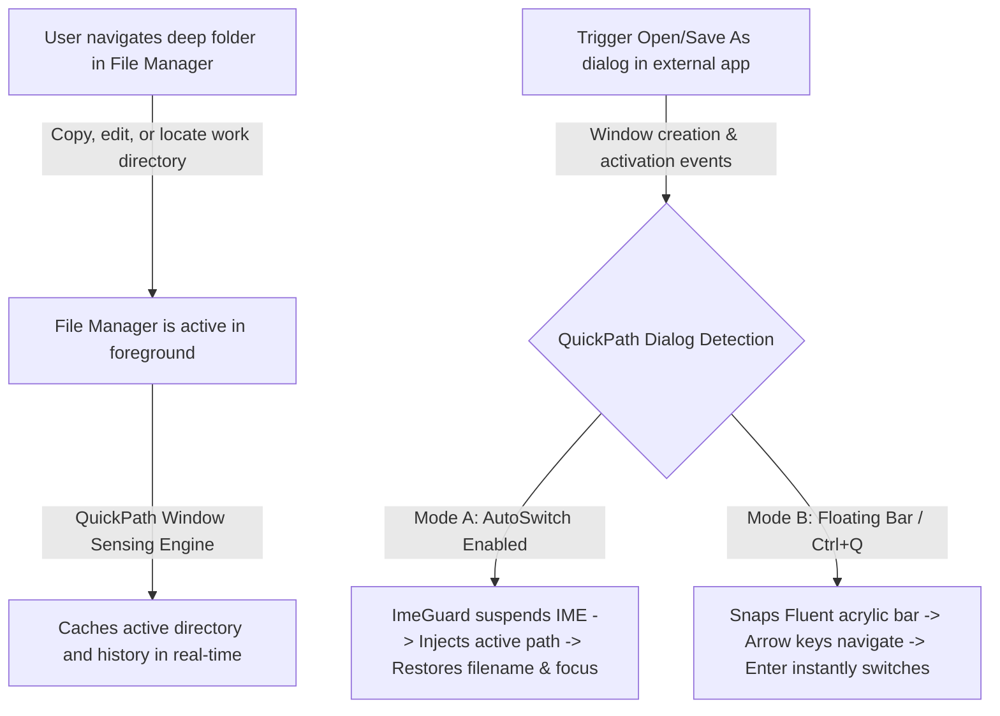

# QuickPath User Manual & Technical Guide

<div align="center">

[使用说明书 (中文)](User_Manual_CN.md) | **English Manual** · [Back to Home](../README.md)

[](#)
[](https://microsoft.com)
[](https://qp.yftec.top)
[](../LICENSE)

**A Modern Fluent-Style Smart Path Following and Quick Navigation Companion for Windows File Dialogs**

[🌐 Official Website](https://qp.yftec.top) · [🐙 GitHub Repository](https://github.com/clhome/QuickPath) · [💬 Submit Issues](https://github.com/clhome/QuickPath/issues)

</div>

---

## Table of Contents

- [1. Product Overview & Working Principles](#1-product-overview--working-principles)
- [2. System Requirements & Runtime Environment](#2-system-requirements--runtime-environment)
- [3. Installation & Startup Modes](#3-installation--startup-modes)
- [4. Core Features & Operation Guide](#4-core-features--operation-guide)
  - [4.1 Smart AutoSwitch](#41-smart-autoswitch)
  - [4.2 Modern Fluent Floating Bar](#42-modern-fluent-floating-bar)
  - [4.3 IME Guard & Filename Preservation](#43-ime-guard--filename-preservation)
  - [4.4 File Manager Ecosystem Integration](#44-file-manager-ecosystem-integration)
- [5. Graphical Settings Center Guide](#5-graphical-settings-center-guide)
  - [5.1 Opening the Settings Center](#51-opening-the-settings-center)
  - [5.2 Configuration Options in Detail](#52-configuration-options-in-detail)
  - [5.3 Settings Draft & Apply Mechanism](#53-settings-draft--apply-mechanism)
- [6. Configuration File & Advanced Customization](#6-configuration-file--advanced-customization)
  - [6.1 Schema & Field Reference](#61-schema--field-reference)
  - [6.2 Process Blacklist Strategy](#62-process-blacklist-strategy)
  - [6.3 Custom External Language Packs](#63-custom-external-language-packs)
- [7. Troubleshooting & FAQ](#7-troubleshooting--faq)
- [8. Producer & License](#8-producer--license)

---

## 1. Product Overview & Working Principles

### 1.1 The Everyday Friction
In typical desktop workflows, power users (developers, designers, video editors, and office workers) constantly switch between **file managers (such as Windows Explorer or Directory Opus)** and **file dialogs ("Open" / "Save As")** in various productivity applications.

Common pain points include:
1. Navigating deep into a complex project folder in your file manager, only to open a file dialog in an IDE or editor that defaults back to "Downloads" or "Documents";
2. Having to manually expand long directory tree hierarchies or copy the folder path from Explorer's address bar and paste it into the dialog;
3. Using outdated scripting utilities that trigger Input Method Editor (IME) candidate popups during paste operations, causing typographical errors or wiping out previously typed filenames.

### 1.2 The QuickPath Solution
**QuickPath** eliminates this disconnect completely. Leveraging native WinEvent hooks and precision Win32 control identification, it provides a sub-100ms path synchronization pipeline:



---

## 2. System Requirements & Runtime Environment

| Specification | Requirement / Details |
| :--- | :--- |
| **Operating System** | Windows 10 (Build 1809 or later) / Windows 11 (All versions, full multi-tab support) |
| **Architecture** | x86_64 (64-bit) |
| **Runtime Dependencies** | Built purely with native Rust; **Zero external runtime dependencies** (No .NET, VC++ Redistributable, or Python required) |
| **Binary Footprint** | Approximately **1.2 MB** (includes embedded high-DPI branding assets and bilingual packages) |
| **System Resource Usage** | Background RAM footprint **< 10 MB**, Idle CPU utilization **0%** |
| **Multi-Monitor & DPI** | Full Per-Monitor V2 DPI Awareness; perfectly scales across 100%, 125%, 150%, 175%, and 200% displays |

---

## 3. Installation & Startup Modes

### 3.1 Portable Zero-Install Usage
QuickPath is distributed as a completely portable, standalone single-file binary:
1. Extract `quickpath.exe` to any folder of your choice (e.g., `D:\Tools\QuickPath\` or a USB flash drive);
2. Double-click `quickpath.exe` to run it silently in the background;
3. Once running, the QuickPath logo appears in the Windows system notification tray area (near the clock).

### 3.2 Dual Configuration Storage Modes
- **Portable Mode**: If `quickpath.json` is located in the same directory as the executable, QuickPath stores all user preferences and history locally in that file;
- **Standard Mode**: If no local JSON file is present, preferences are safely stored in `%APPDATA%\QuickPath\config.json`.

### 3.3 UAC-Free Silent AutoStart
- QuickPath features built-in **Windows Task Scheduler** registration for automatic startup;
- This allows QuickPath to launch with highest privileges on system boot **without displaying annoying yellow UAC elevation prompts**;
- Elevated execution ensures seamless inter-process communication with other software running as administrator (e.g., Visual Studio, Elevated Terminals, IDA Pro).

---

## 4. Core Features & Operation Guide

### 4.1 Smart AutoSwitch
- **Description**:
  When transitioning from a supported file manager to an application triggering an "Open" or "Save As" dialog, QuickPath recognizes the contextual relationship and instantly switches the dialog directory to match your active folder.
- **Tuning & Response Delay**:
  - AutoSwitch can be toggled on/off in the Settings Center;
  - **Switch Delay (ms)**: Default is `80ms`. For legacy applications with slower internal UI initialization, consider setting this to `120ms` ~ `150ms`; for rapid switching, `60ms` ~ `80ms` is optimal.
- **Safety & Anti-Overwrite Protection**:
  If you have already started browsing or modifying the directory within the dialog, QuickPath will not re-inject or overwrite your active navigation.

### 4.2 Modern Fluent Floating Bar
- **Visual Design**:
  Employs native Windows 11 Mica and Acrylic blur with smooth rounded corners and adjustable opacity (40% to 100%).
- **Snapping & Positioning**:
  - When a file dialog appears, the bar snaps smoothly to its border (adapting to left, right, or top edges according to screen real estate);
  - Default Summon Hotkey: **`Ctrl + Q`** (fully customizable in settings).
- **High-Density Single-Line Candidate Layout**:
  Candidates are presented in a clean, compact single-line layout:
  ```
  📁 [Folder Name]      D:\Work\Projects\QuickPath      [Source Badge: Active / History / Pinned]
  ```
  Displays up to 8 recent and relevant candidates.
- **Pure Keyboard Blind Navigation**:
  - `↑` / `↓`: Move selection through candidate folders;
  - `Enter`: Confirm selection and inject the directory into the dialog;
  - `Esc`: Dismiss the floating bar;
  - Top header features the producer attribution with a direct clickable link to the official website.

### 4.3 IME Guard & Filename Preservation (ImeGuard)
- **Input Method Editor Guard (ImeGuard)**:
  When communicating with Win32 edit and address bar controls, QuickPath suspends the active thread's IME candidate window for microseconds and restores it immediately upon injection. This prevents Chinese, Japanese, or third-party IMEs from producing pinyin letter sequences or corrupted characters;
- **Intelligent Filename Preservation**:
  In "Save As" scenarios where you have already typed a custom filename (e.g., `Financial_Report_Q4.xlsx`), QuickPath isolates the filename, synchronizes only the target directory, and **never clears or overwrites your filename**.

### 4.4 File Manager Ecosystem Integration

| File Manager | Integration Principle & Details |
| :--- | :--- |
| **Windows 11 File Explorer** | Native **Multi-Tab** recognition. Overcomes legacy COM limitations to pinpoint the currently focused tab |
| **Windows 10 File Explorer** | Full support for standard single-window `CabinetWClass` enumeration |
| **Directory Opus (DOpus)** | Bridges via `dopusrt` command-line IPC to retrieve active Lister paths in milliseconds |
| **Total Commander (TC)** | Auto-detects active pane paths via window messages, restoring clipboard state seamlessly |
| **XYplorer** | Uses `WM_COPYDATA` scripting interface for zero-delay path extraction |

---

## 5. Graphical Settings Center Guide

### 5.1 Opening the Settings Center
- **Mouse Action**: **Single-click** or **Double-click** the QuickPath icon in the system notification tray;
- **Context Menu**: **Right-click** the tray icon and select **"⚙️ Settings"**.

### 5.2 Configuration Options in Detail

The Settings Center utilizes a modern Fluent card layout:

1. **Smart AutoSwitch**
   - **Toggle Switch**: Click or drag the toggle switch horizontally to enable or disable automatic path following;
   - **Response Delay**: Fine-tune the millisecond delay slider to balance responsiveness and stability.

2. **Floating Bar Appearance**
   - **Custom Opacity Slider**: Smoothly adjust transparency between **40% and 100%**;
   - Real-time visual feedback updates the acrylic blur density dynamically.

3. **Global Hotkey**
   - Displays the currently assigned shortcut badge (e.g., `Ctrl + Q`);
   - **Interactive Recording**: Click the card to enter recording mode ("Press shortcut combination..."). Press any desired key combo (e.g., `Ctrl + Shift + F`, `Alt + D`, `Win + Q`);
   - Press `Esc` to cancel recording without making changes;
   - New shortcuts are re-registered dynamically without restarting the application.

4. **AutoStart on Boot**
   - Toggles Windows Task Scheduler registration for silent, UAC-free execution on startup.

5. **Language Selection**
   - Select between **简体中文 (Simplified Chinese)** and **English** via a native dropdown menu;
   - All interfaces, tray menus, floating bars, and tooltips update immediately.

6. **About QuickPath Card**
   - Features the high-resolution bicubic resampled QuickPath logo;
   - Displays version number, product overview, and producer branding (*Quzhou Yufeng Technology Co., Ltd.*);
   - Includes clickable hyperlinks to the official website ([https://qp.yftec.top](https://qp.yftec.top)) and the GitHub repository ([https://github.com/clhome/QuickPath](https://github.com/clhome/QuickPath)).

### 5.3 Settings Draft & Apply Mechanism
- **Draft Protection**: Modifications made inside the settings window remain in draft state until confirmed;
- **Click "OK"**: Commits all changes to disk, hot-reloads global runtime `AppState`, synchronizes the Task Scheduler, and closes the window;
- **Click "Cancel" or Close [X]**: Discards pending changes and restores the previous configuration.

---

## 6. Configuration File & Advanced Customization

### 6.1 Schema & Field Reference
Settings are serialized in standard JSON format:

```json
{
  "auto_switch_enabled": true,
  "auto_switch_delay_ms": 80,
  "hotkey": "Ctrl+Q",
  "floating_bar_enabled": true,
  "floating_bar_auto_show": false,
  "floating_bar_opacity": 90,
  "autostart_enabled": false,
  "autostart_task_scheduler": true,
  "language": "en-US",
  "blacklist_processes": [
    "chrome.exe",
    "msedge.exe",
    "firefox.exe",
    "brave.exe"
  ],
  "pinned_folders": [
    "D:\\Projects",
    "C:\\Users\\Public\\Downloads"
  ],
  "history_folders": []
}
```

### 6.2 Process Blacklist Strategy (`blacklist_processes`)
Certain applications may have specific download behaviors where automatic path switching is undesirable:
- Web browsers (Chrome, Edge, Firefox): Users often prefer saving web downloads to a fixed default folder;
- Add lower-case executable names to the `blacklist_processes` array (e.g., `"notepad.exe"`). QuickPath will bypass AutoSwitch for these processes while still allowing manual summoning via hotkey.

### 6.3 Custom External Language Packs
QuickPath includes embedded English and Simplified Chinese localization, while allowing arbitrary external language extensions:
1. Create a `locales/` directory next to `quickpath.exe`;
2. Add your TOML file (e.g., `locales/ja-JP.toml` or `locales/de-DE.toml`);
3. Translate keys following the structure of `en-US.toml`;
4. Re-open the Settings Center, and the new language will appear in the dropdown menu automatically.

---

## 7. Troubleshooting & FAQ

### Q1: Why doesn't QuickPath switch paths in certain applications?
- **Cause 1 (UIPI Elevation Isolation)**: If the target application was launched as Administrator while QuickPath runs with standard user privileges, Windows User Interface Privilege Isolation (UIPI) blocks cross-privilege communication. **Solution**: Enable "AutoStart" in settings or run QuickPath as Administrator.
- **Cause 2 (Process Blacklist)**: Verify that the process is not listed in `blacklist_processes` inside `config.json`.
- **Cause 3 (Timing)**: Increase the switch response delay in settings from `80ms` to `120ms` ~ `150ms`.

### Q2: Shortcut hotkey fails to register or conflicts?
- If the selected shortcut is already registered by another global application (e.g., chat applications, PowerToys), Windows will reject registration. Choose an alternative combination in settings.

### Q3: How does the floating bar handle multi-monitor or mixed DPI setups?
- QuickPath utilizes real-time DPI queries (`GetDpiForMonitor`) to detect the specific physical display containing the file dialog, recalculating bounds and scale factors dynamically to prevent window clipping.

### Q4: Antivirus false positives?
- QuickPath is built from clean, open-source Rust. Because it utilizes `SetWinEventHook` to monitor window focus and registers global hotkeys, rare heuristics-based antivirus engines might flag it. QuickPath contains zero telemetry, backdoors, or adware; you can safely whitelist it or inspect the source code.

---

## 8. Producer & License

- **Producer**: Quzhou Yufeng Technology Co., Ltd. (衢州御风科技有限公司)
- **Official Website**: [https://qp.yftec.top](https://qp.yftec.top)
- **GitHub Repository**: [https://github.com/clhome/QuickPath](https://github.com/clhome/QuickPath)
- **License**: Released under the [GNU General Public License v3.0 (GPL-3.0)](../LICENSE).
