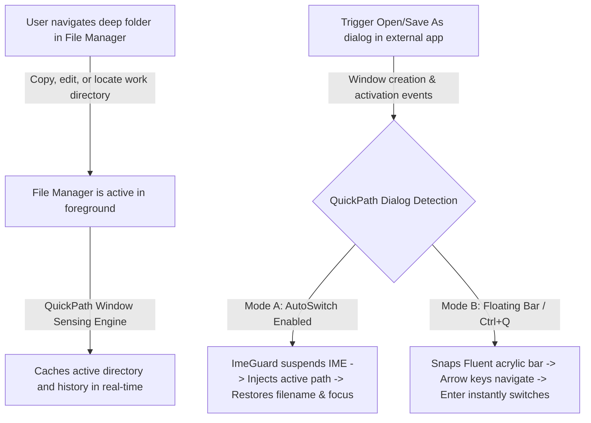

# QuickPath User Manual & Technical Guide

<div align="center">

[使用说明书 (中文)](User_Manual_CN.md) | **English Manual** · [Back to Home](../README.md)

[](#)
[](https://microsoft.com)
[](https://qp.yftec.top)
[](../LICENSE)

**A Modern Fluent-Style Smart Path Following and Quick Navigation Companion for Windows File Dialogs**

[🌐 Official Website](https://qp.yftec.top) · [🐙 GitHub Repository](https://github.com/clhome/QuickPath) · [💬 Submit Issues](https://github.com/clhome/QuickPath/issues)

</div>

---

## Table of Contents

- [1. Product Overview & Working Principles](#1-product-overview--working-principles)
- [2. System Requirements & Runtime Environment](#2-system-requirements--runtime-environment)
- [3. Installation & Startup Modes](#3-installation--startup-modes)
- [4. Core Features & Operation Guide](#4-core-features--operation-guide)
  - [4.1 Smart AutoSwitch](#41-smart-autoswitch)
  - [4.2 Modern Fluent Floating Bar](#42-modern-fluent-floating-bar)
  - [4.3 IME Guard & Filename Preservation](#43-ime-guard--filename-preservation)
  - [4.4 File Manager Ecosystem Integration](#44-file-manager-ecosystem-integration)
  - [4.5 Taskbar Hardware Status Monitor (New in Ver 1.1.0)](#45-taskbar-hardware-status-monitor-new-in-ver-110)
- [5. Graphical Settings Center Guide](#5-graphical-settings-center-guide)
  - [5.1 Opening the Settings Center](#51-opening-the-settings-center)
  - [5.2 Configuration Options in Detail](#52-configuration-options-in-detail)
  - [5.3 Settings Draft & Apply Mechanism](#53-settings-draft--apply-mechanism)
- [6. Configuration File & Advanced Customization](#6-configuration-file--advanced-customization)
  - [6.1 Schema & Field Reference](#61-schema--field-reference)
  - [6.2 Process Blacklist Strategy](#62-process-blacklist-strategy)
  - [6.3 Custom External Language Packs](#63-custom-external-language-packs)
- [7. Troubleshooting & FAQ](#7-troubleshooting--faq)
- [8. Producer & License](#8-producer--license)

---

## 1. Product Overview & Working Principles

### 1.1 The Everyday Friction
In typical desktop workflows, power users (developers, designers, video editors, and office workers) constantly switch between **file managers (such as Windows Explorer or Directory Opus)** and **file dialogs ("Open" / "Save As")** in various productivity applications.

Common pain points include:
1. Navigating deep into a complex project folder in your file manager, only to open a file dialog in an IDE or editor that defaults back to "Downloads" or "Documents";
2. Having to manually expand long directory tree hierarchies or copy the folder path from Explorer's address bar and paste it into the dialog;
3. Using outdated scripting utilities that trigger Input Method Editor (IME) candidate popups during paste operations, causing typographical errors or wiping out previously typed filenames.

### 1.2 The QuickPath Solution
**QuickPath** eliminates this disconnect completely. Leveraging native WinEvent hooks and precision Win32 control identification, it provides a sub-100ms path synchronization pipeline:



---

## 2. System Requirements & Runtime Environment

| Specification | Requirement / Details |
| :--- | :--- |
| **Operating System** | Windows 10 (Build 1809 or later) / Windows 11 (All versions, full multi-tab support) |
| **Architecture** | x86_64 (64-bit) |
| **Runtime Dependencies** | Built purely with native Rust; **Zero external runtime dependencies** (No .NET, VC++ Redistributable, or Python required) |
| **Binary Footprint** | Approximately **1.2 MB** (includes embedded high-DPI branding assets and bilingual packages) |
| **System Resource Usage** | Background RAM footprint **< 10 MB** (Incremental RAM footprint $\le 5\text{ MB}$ when Taskbar Monitor is active), Idle CPU utilization **0%** (Worker thread sampling incremental CPU $\le 0.05\%$; when disabled, worker thread and handles are fully terminated, yielding absolute 0% CPU & 0 MB overhead) |
| **Multi-Monitor & DPI** | Full Per-Monitor V2 DPI Awareness; perfectly scales across 100%, 125%, 150%, 175%, and 200% displays |

---

## 3. Installation & Startup Modes

### 3.1 Portable Zero-Install Usage
QuickPath is distributed as a completely portable, standalone single-file binary:
1. Extract `quickpath.exe` to any folder of your choice (e.g., `D:\Tools\QuickPath\` or a USB flash drive);
2. Double-click `quickpath.exe` to run it silently in the background;
3. Once running, the QuickPath logo appears in the Windows system notification tray area (near the clock).

### 3.2 Dual Configuration Storage Modes
- **Portable Mode**: If `quickpath.json` is located in the same directory as the executable, QuickPath stores all user preferences and history locally in that file;
- **Standard Mode**: If no local JSON file is present, preferences are safely stored in `%APPDATA%\QuickPath\config.json`.

### 3.3 UAC-Free Silent AutoStart
- QuickPath features built-in **Windows Task Scheduler** registration for automatic startup;
- This allows QuickPath to launch with highest privileges on system boot **without displaying annoying yellow UAC elevation prompts**;
- Elevated execution ensures seamless inter-process communication with other software running as administrator (e.g., Visual Studio, Elevated Terminals, IDA Pro).

---

## 4. Core Features & Operation Guide

### 4.1 Smart AutoSwitch
- **Description**:
  When transitioning from a supported file manager to an application triggering an "Open" or "Save As" dialog, QuickPath recognizes the contextual relationship and instantly switches the dialog directory to match your active folder.
- **Tuning & Response Delay**:
  - AutoSwitch can be toggled on/off in the Settings Center;
  - **Switch Delay (ms)**: Default is `80ms`. For legacy applications with slower internal UI initialization, consider setting this to `120ms` ~ `150ms`; for rapid switching, `60ms` ~ `80ms` is optimal.
- **Safety & Anti-Overwrite Protection**:
  If you have already started browsing or modifying the directory within the dialog, QuickPath will not re-inject or overwrite your active navigation.

### 4.2 Modern Fluent Floating Bar
- **Visual Design**:
  Employs native Windows 11 Mica and Acrylic blur with smooth rounded corners and adjustable opacity (40% to 100%).
- **Snapping & Positioning**:
  - When a file dialog appears, the bar snaps smoothly to its border (adapting to left, right, or top edges according to screen real estate);
  - Default Summon Hotkey: **`Ctrl + Q`** (fully customizable in settings).
- **High-Density Single-Line Candidate Layout**:
  Candidates are presented in a clean, compact single-line layout:
  ```
  📁 [Folder Name]      D:\Work\Projects\QuickPath      [Source Badge: Active / History / Pinned]
  ```
  Displays up to 8 recent and relevant candidates.
- **Pure Keyboard Blind Navigation**:
  - `↑` / `↓`: Move selection through candidate folders;
  - `Enter`: Confirm selection and inject the directory into the dialog;
  - `Esc`: Dismiss the floating bar;
  - Top header features the producer attribution with a direct clickable link to the official website.

### 4.3 IME Guard & Filename Preservation (ImeGuard)
- **Input Method Editor Guard (ImeGuard)**:
  When communicating with Win32 edit and address bar controls, QuickPath suspends the active thread's IME candidate window for microseconds and restores it immediately upon injection. This prevents Chinese, Japanese, or third-party IMEs from producing pinyin letter sequences or corrupted characters;
- **Intelligent Filename Preservation**:
  In "Save As" scenarios where you have already typed a custom filename (e.g., `Financial_Report_Q4.xlsx`), QuickPath isolates the filename, synchronizes only the target directory, and **never clears or overwrites your filename**.

### 4.4 File Manager Ecosystem Integration

| File Manager | Integration Principle & Details |
| :--- | :--- |
| **Windows 11 File Explorer** | Native **Multi-Tab** recognition. Overcomes legacy COM limitations to pinpoint the currently focused tab |
| **Windows 10 File Explorer** | Full support for standard single-window `CabinetWClass` enumeration |
| **Directory Opus (DOpus)** | Bridges via `dopusrt` command-line IPC to retrieve active Lister paths in milliseconds |
| **Total Commander (TC)** | Auto-detects active pane paths via window messages, restoring clipboard state seamlessly |
| **XYplorer** | Uses `WM_COPYDATA` scripting interface for zero-delay path extraction |

### 4.5 Taskbar Hardware Status Monitor (New in Ver 1.1.0)

#### 4.5.1 Module Positioning & Unprivileged Lightweight Design
Integrated as QuickPath's **built-in optional extension module** (enabled by default, fully toggleable in settings or the system tray menu), providing desktop users with a minimalistic, zero-overhead, highly reliable native Windows taskbar hardware dashboard:
- **Unprivileged Official APIs**: Operates purely within standard user-mode Windows APIs (IP Helper API `GetIfTable2`, `GetSystemTimes`, `GlobalMemoryStatusEx`, PDH Performance Counters, DXGI `IDXGIAdapter3`), eliminating any Ring 0 kernel driver dependencies or system crash vulnerabilities;
- **Extreme Lightweight & Zero Idle Waste**: Consumes $\le 5\text{ MB}$ additional working set RAM when active ($\le 0.05\%$ incremental CPU); **when disabled, the background worker sampling thread and all system query handles are completely released, dropping to absolute 0% CPU and 0 MB incremental footprint**.

#### 4.5.2 Compact Two-Row Layout & ClearType Crisp Rendering
Features a high-density, two-row compact grid layout (height dynamically conforms to the 32~40px taskbar, with width smoothly self-adjusting from ~40px to ~130px depending on selected metrics):

```text
┌───────────────────────────────────────────┐
│  ↑  1.2     C: 19%    G: 32%              │  <- Row 1: Upload Mbps (Hidden Unit)   | CPU% (Mini Bar) | GPU%
│  ↓  3.5     M: 42%    D:  3%              │  <- Row 2: Download Mbps (Hidden Unit) | RAM% (Mini Bar) | Disk Activity
└───────────────────────────────────────────┘
```

- **Streamlined Unit-Free Network Display**: Bitrates are normalized to `Mbps` with text unit labels omitted (retaining only directional arrow prefixes `↑` and `↓`). Values $< 100$ maintain 1 decimal place, while values $\ge 100$ display as integers, saving nearly 40% taskbar width;
- **Dynamic Column Shrink Engine**: Metrics are grouped into 3 logical columns (Network, CPU/RAM, GPU/Disk). Unselected columns collapse completely without occupying any pixels, ensuring zero unnecessary whitespace;
- **Mini Indicator Bars & 3-Tier Dynamic Threshold Coloring**: CPU and RAM values feature a 2px dynamic gauge bar below numbers. All CMGD metrics (CPU, Memory, GPU, Disk) dynamically tint based on utilization: `< 70%` Vivid Green, `70% ~ 85%` Bright Yellow, `> 85%` Warning Red;
- **Solid Dark Background & Win32 ClearType Rendering**: Renders via `Microsoft YaHei UI` with native ClearType smoothing and smooth alpha protection, preventing wallpaper bleeding and ragged edges;
- **Real-Time Historical Waveform Graph Background**: Displays an optional 15~20 second rolling waveform polyline behind metric text (1000ms sampling ring buffer) to instantly visualize short-term spikes;
- **Three Sampling Refresh Rates**: Choose between 1.0s, 3.0s (recommended default), and 5.0s.

#### 4.5.3 Dual Dock Position Modes
Freely switch docking location via Settings or the right-click menu:
1. **Right of Taskbar (TrayLeft, Default)**: Neatly docks directly adjacent to the left edge of the system notification tray area;
2. **Above Taskbar Left Float (TaskbarLeft)**: Floats independently directly above the upper edge of the taskbar on the left side, physically separating from running application taskbar buttons to eliminate overlap.

#### 4.5.4 Full-Screen Auto-Hide (Game & Media Stealth Evasion)
Specially engineered to protect immersive experiences during gaming and presentations:
- Continuously monitors foreground windows. When a full-screen application is detected (e.g., 3D games, full-screen video, PowerPoint slide shows covering the primary display), the monitor window invokes `ShowWindow(SW_HIDE)` silently;
- Instantly and smoothly reappears upon returning to the desktop or normal windowed workflows;
- Fully synchronized with the Windows Taskbar "Auto-Hide" mode.

#### 4.5.5 Fluent Hardware Dashboard (Tooltip)
Hovering over the docked monitor bar for 400ms reveals a modern Fluent dark card dashboard with high-contrast `Microsoft YaHei UI` typography and auto-scaled dimensions:
- **Network Bitrate & Adapter**: Displays dual units (both Mbps and MB/s) along with the active physical network adapter name (accurately filtering loopback, virtual adapters, Docker, WSL, VMware, and VPNs);
- **Processor (CPU)**: Reports total utilization and highlights the **Top 1 resource consumer process name and percentage**;
- **Physical Memory (RAM)**: Shows percentage and exact allocation (e.g., `Used 13.4 GB / Total 32.0 GB`);
- **Dedicated Graphics (GPU)**: Shows composite 3D/Compute utilization and **Dedicated VRAM** allocation (e.g., `3.8 GB / 8.0 GB`, strictly filtering out inflated shared system memory);
- **Disk I/O**: Real-time read and write throughput in MB/s;
- **Continuous System Uptime**: Accurate boot uptime calculated via `GetTickCount64`, unaffected by Windows Fast Startup;
- **Power & Battery**: Reports AC power connection or current battery percentage;
- **Producer Attribution**: Displays producer branding with a clickable link to the official website, supporting seamless mouse cursor transit between the docked bar and the dashboard.

#### 4.5.6 Mouse & Shortcut Controls
- **Double-Click**: Quickly launches Windows Task Manager (`taskmgr.exe`) via `ShellExecuteW`;
- **Right-Click**: Opens native context menu with quick controls:
  - `Open QuickPath Settings...` (navigates directly to Taskbar Monitor tab)
  - `Show Metrics` (independently toggle Network, CPU, RAM, GPU, Disk)
  - `Show Historical Waveform` (toggle waveform background)
  - `Dock Position` (toggle Right of Taskbar / Above Taskbar Left Float)
  - `Refresh Network Adapters` (re-enumerates active interfaces)
  - `Hide Monitor Panel` (dismisses panel)
  - `Exit QuickPath`
- **System Tray Integration**: Toggle taskbar monitoring on/off at any time from the tray icon's context menu.

---

## 5. Graphical Settings Center Guide

### 5.1 Opening the Settings Center
- **Mouse Action**: **Single-click** or **Double-click** the QuickPath icon in the system notification tray;
- **Context Menu**: **Right-click** the tray icon and select **"⚙️ Settings"**.

### 5.2 Configuration Options in Detail

The Settings Center utilizes a modern Fluent dual-tab card layout (freely toggle between "General Preferences" and "Taskbar Monitor" at the top):

#### "General Preferences" Tab
1. **Smart AutoSwitch**
   - **Toggle Switch**: Click or drag the toggle switch horizontally to enable or disable automatic path following;
   - **Response Delay**: Fine-tune the millisecond delay slider to balance responsiveness and stability.
2. **Floating Bar Appearance**
   - **Custom Opacity Slider**: Smoothly adjust transparency between **40% and 100%**;
   - Real-time visual feedback updates the acrylic blur density dynamically.
3. **Global Hotkey**
   - Displays the currently assigned shortcut badge (e.g., `Ctrl + Q`);
   - **Interactive Recording**: Click the card to enter recording mode ("Press shortcut combination..."). Press any desired key combo (e.g., `Ctrl + Shift + F`, `Alt + D`, `Win + Q`);
   - Press `Esc` to cancel recording without making changes;
   - New shortcuts are re-registered dynamically without restarting the application.
4. **AutoStart on Boot**
   - Toggles Windows Task Scheduler registration for silent, UAC-free execution on startup.
5. **Language Selection**
   - Select between **简体中文 (Simplified Chinese)** and **English** via a native dropdown menu;
   - All interfaces, tray menus, floating bars, and tooltips update immediately.
6. **About QuickPath Card**
   - Features the high-resolution bicubic resampled QuickPath logo;
   - Displays version number, product overview, and producer branding (*Quzhou Yufeng Technology Co., Ltd.*);
   - Includes clickable hyperlinks to the official website ([https://qp.yftec.top](https://qp.yftec.top)) and the GitHub repository ([https://github.com/clhome/QuickPath](https://github.com/clhome/QuickPath)).

#### "Taskbar Monitor" Tab (New in Ver 1.1.0)


1. **Hardware Monitor Master Switch**: Easily enable or completely disable taskbar hardware monitoring. When turned off, the background worker thread exits immediately with zero resource usage;
2. **Dock Position**: Radio buttons for selecting placement:
   - **Right of Taskbar (Default)**: Docks snugly to the left of the system notification tray;
   - **Above Taskbar Left (Float)**: Floats independently directly above the taskbar's left edge, eliminating any overlap with running taskbar app buttons;
3. **Metric Item Checkboxes**: Five independent toggles to customize visible metrics:
   - Network Throughput (Upload / Download)
   - CPU Utilization
   - Physical Memory (RAM)
   - GPU Utilization
   - Disk Activity (Disk)
   The panel dynamically shrinks or widens based on your selection;
4. **Appearance & Sampling Parameters**:
   - **Show Historical Waveform Graph**: Toggles the 15~20s polyline background trend;
   - **Sampling Refresh Rate**: Fluent capsule segmented control offering `1.0s`, `3.0s (Recommended)`, and `5.0s`;
   - **Panel Opacity Slider**: Custom slider adjusting background opacity between `50%` and `100%`.

### 5.3 Settings Draft & Apply Mechanism
- **Draft Protection**: Modifications made inside the settings window remain in draft state until confirmed;
- **Click "OK"**: Commits all changes to disk, hot-reloads global runtime `AppState`, synchronizes the Task Scheduler, and closes the window;
- **Click "Cancel" or Close [X]**: Discards pending changes and restores the previous configuration.

---

## 6. Configuration File & Advanced Customization

### 6.1 Schema & Field Reference
Settings are serialized in standard JSON format:

```json
{
  "auto_switch_enabled": true,
  "auto_switch_delay_ms": 80,
  "hotkey": "Ctrl+Q",
  "floating_bar_enabled": true,
  "floating_bar_auto_show": false,
  "floating_bar_opacity": 90,
  "autostart_enabled": false,
  "autostart_task_scheduler": true,
  "language": "en-US",
  "blacklist_processes": [
    "chrome.exe",
    "msedge.exe",
    "firefox.exe",
    "brave.exe"
  ],
  "pinned_folders": [
    "D:\\Projects",
    "C:\\Users\\Public\\Downloads"
  ],
  "history_folders": [],
  "monitor": {
    "enabled": true,
    "position": "TrayLeft",
    "show_network": true,
    "show_cpu": true,
    "show_memory": true,
    "show_gpu": true,
    "show_disk": true,
    "show_graph_bg": true,
    "refresh_interval_ms": 3000,
    "opacity": 95
  }
}
```

#### Taskbar Hardware Monitor Configuration Properties (New in Ver 1.1.0)
| Property | Type | Default | Description |
| :--- | :--- | :--- | :--- |
| `enabled` | boolean | `true` | Master switch for taskbar hardware status monitoring (background worker thread terminates completely when false, zero overhead) |
| `position` | string | `"TrayLeft"` | Docking location mode: `"TrayLeft"` (Right of Taskbar default) or `"TaskbarLeft"` (Above Taskbar Left Float) |
| `show_network` | boolean | `true` | Whether to display real-time network throughput (Row 1 upload, Row 2 download) |
| `show_cpu` | boolean | `true` | Whether to display processor utilization (CPU) and mini indicator bar |
| `show_memory` | boolean | `true` | Whether to display physical memory utilization (RAM) and mini indicator bar |
| `show_gpu` | boolean | `true` | Whether to display dedicated graphics utilization (GPU) |
| `show_disk` | boolean | `true` | Whether to display disk I/O activity utilization (Disk) |
| `show_graph_bg` | boolean | `true` | Whether to render the 15~20 second historical waveform polyline background |
| `refresh_interval_ms` | integer | `3000` | Sampling refresh interval in milliseconds (supports 1000 / 3000 / 5000) |
| `opacity` | integer | `95` | Monitor panel background opacity percentage (50 ~ 100) |

### 6.2 Process Blacklist Strategy (`blacklist_processes`)
Certain applications may have specific download behaviors where automatic path switching is undesirable:
- Web browsers (Chrome, Edge, Firefox): Users often prefer saving web downloads to a fixed default folder;
- Add lower-case executable names to the `blacklist_processes` array (e.g., `"notepad.exe"`). QuickPath will bypass AutoSwitch for these processes while still allowing manual summoning via hotkey.

### 6.3 Custom External Language Packs
QuickPath includes embedded English and Simplified Chinese localization, while allowing arbitrary external language extensions:
1. Create a `locales/` directory next to `quickpath.exe`;
2. Add your TOML file (e.g., `locales/ja-JP.toml` or `locales/de-DE.toml`);
3. Translate keys following the structure of `en-US.toml`;
4. Re-open the Settings Center, and the new language will appear in the dropdown menu automatically.

---

## 7. Troubleshooting & FAQ

### Q1: Why doesn't QuickPath switch paths in certain applications?
- **Cause 1 (UIPI Elevation Isolation)**: If the target application was launched as Administrator while QuickPath runs with standard user privileges, Windows User Interface Privilege Isolation (UIPI) blocks cross-privilege communication. **Solution**: Enable "AutoStart" in settings or run QuickPath as Administrator.
- **Cause 2 (Process Blacklist)**: Verify that the process is not listed in `blacklist_processes` inside `config.json`.
- **Cause 3 (Timing)**: Increase the switch response delay in settings from `80ms` to `120ms` ~ `150ms`.

### Q2: Shortcut hotkey fails to register or conflicts?
- If the selected shortcut is already registered by another global application (e.g., chat applications, PowerToys), Windows will reject registration. Choose an alternative combination in settings.

### Q3: How does the floating bar handle multi-monitor or mixed DPI setups?
- QuickPath utilizes real-time DPI queries (`GetDpiForMonitor`) to detect the specific physical display containing the file dialog, recalculating bounds and scale factors dynamically to prevent window clipping.

### Q4: Antivirus false positives?
- QuickPath is built from clean, open-source Rust. Because it utilizes `SetWinEventHook` to monitor window focus and registers global hotkeys, rare heuristics-based antivirus engines might flag it. QuickPath contains zero telemetry, backdoors, or adware; you can safely whitelist it or inspect the source code.

### Q5: Why does the monitor panel disappear during full-screen games, videos, or presentations? *(New in Ver 1.1.0)*
- **Answer**: This is intentional behavior driven by QuickPath's built-in "Full-Screen Stealth Evasion Mechanism". Whenever the foreground window occupies full-screen resolution (e.g., 3D games, video players in full screen, PowerPoint presentations), the monitor panel automatically hides silently to prevent obstructing gameplay visuals or subtitles. It seamlessly restores once you return to windowed mode or the desktop.

### Q6: Why are unit suffixes hidden on the docked network speed display? *(New in Ver 1.1.0)*
- **Answer**: To achieve a high-density, compact layout within precious taskbar real estate, bitrates are calculated uniformly in `Mbps` while text labels are omitted (retaining only `↑` and `↓` arrow prefixes). This saves nearly 40% of taskbar width. To view comprehensive dual units (both MB/s and Mbps) as well as the active physical adapter name, simply hover over the monitor bar to inspect the Hardware Dashboard tooltip.

### Q7: What does Dedicated VRAM represent, and why does it differ from total VRAM shown in some tools? *(New in Ver 1.1.0)*
- **Answer**: QuickPath strictly measures the dedicated graphics card's physical on-board memory (**Dedicated VRAM**, e.g., 4.0 GB physical VRAM) via DXGI and PDH hardware queries. This intentionally filters out the inflated "Shared GPU Memory" pool that Windows dynamically allocates from system RAM, reflecting true hardware video memory pressure.

### Q8: How can I change the docking position of the monitor on the taskbar? *(New in Ver 1.1.0)*
- **Answer**: Right-click the monitor bar and select "Dock Position", or configure it under the "Taskbar Monitor" tab in Settings:
  - **Right of Taskbar (Default)**: Docks snugly to the left of the notification tray icons;
  - **Above Taskbar Left (Float)**: Floats independently directly above the taskbar's left edge, completely preventing any visual overlap with running application taskbar icons.

---

## 8. Producer & License

- **Producer**: Quzhou Yufeng Technology Co., Ltd. (衢州御风科技有限公司)
- **Official Website**: [https://qp.yftec.top](https://qp.yftec.top)
- **GitHub Repository**: [https://github.com/clhome/QuickPath](https://github.com/clhome/QuickPath)
- **License**: Released under the [GNU General Public License v3.0 (GPL-3.0)](../LICENSE).
