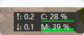

# 产品需求文档 (PRD)：quickpath 状态监控模块

## 1. 文档概述与产品定位

- **产品名称**：quickpath 状态监控模块
- **目标平台**：Windows 10 / Windows 11 (x86_64 / ARM64)
- **核心定位**：极简、低开销、高可靠的 Windows 原生任务栏硬件监控工具。在普通用户权限下运行，彻底告别内核驱动依赖。
- **设计哲学**：
  - **极限轻量**：静默内存常驻 $\le 20 \text{ MB}$，CPU 占用 $\le 0.05\%$，无 Electron/WebView 开销。
  - **常驻精简，悬停丰富**：任务栏仅显示高频关键数据，深层统计下沉至 Tooltip。
  - **坚若磐石**：容忍锁屏、睡眠唤醒、多屏热插拔、驱动崩溃与 Explorer 重启，永不静默挂起或异常崩溃。

## 2. 核心指标与采集规格

所有指标严格选用 Windows 官方免特权用户态 API，排除任何需要 Ring 0 驱动的硬件温度项。

### 2.1 指标采集矩阵

| **模块分类**       | **指标项**           | **展示格式**       | **底层 API / 数据源**                               | **计算与单位转换逻辑**                                       |
| ------------------ | -------------------- | ------------------ | --------------------------------------------------- | ------------------------------------------------------------ |
| **网络**           | 实时上传速率         | `↑: 1.2`           | `GetIfTable2` (IP Helper)                           | 计算有效物理网卡发送差值 $\Delta \text{Bytes} / \Delta t$，单位自动换算为 `Mb/s` |
| **网络**           | 实时下载速率         | `↓: 0.35`          | `GetIfTable2` (IP Helper)                           | 自动过滤回环（Loopback）、虚拟网卡（Hyper-V/WSL/VPN），计算接收差值 |
| **计算**           | CPU 总占用率         | `C: 18%`           | `GetSystemTimes`                                    | 计算采样周期内系统时间占比：$(1.0 - \frac{\Delta \text{Idle}}{\Delta \text{Kernel} + \Delta \text{User}}) \times 100\%$ |
| **计算**           | GPU 综合利用率       | `G: 32%`           | PDH 计数器：`\GPU Engine(*)\Utilization Percentage` | 聚合当前活动 GPU 的 3D/Compute 引擎利用率峰值；无 GPU 时优雅降级隐藏或显示为 `--%` |
| **存储**           | 物理内存利用率       | `M: 42%`           | `GlobalMemoryStatusEx`                              | 提取 `MEMORYSTATUSEX.dwMemoryLoad` 或使用 $(1.0 - \frac{\text{AvailPhys}}{\text{TotalPhys}}) \times 100\%$ |
| **存储**           | 磁盘实时读写吞吐占比 | `D: 3%`            |                                                     | 汇总所有物理驱动器的实时 I/O 速率，显示磁盘读写百分比        |
| **环境 (Tooltip)** | 电池状态与续航       | `98% (接通电源)`   | `GetSystemPowerStatus`                              | 读取充电状态、百分比及剩余使用时间；台式机不显示             |
| **系统 (Tooltip)** | 系统运行时间         | `运行: 3天 14时`   | `GetTickCount64`                                    | 格式化系统无中断启动时长，不受“快速启动”假关机欺骗           |
| **诊断 (Tooltip)** | 资源消耗 Top 1 进程  | `Top: chrome(18%)` | `CreateToolhelp32Snapshot`                          | **按需触发**：仅当鼠标悬停进入 Tooltip 时执行单次快照，平时禁止后台高频轮询 |

## 3. 界面交互与排版规范

### 3.1 任务栏常驻面板布局

采用两行紧凑栅格布局，高度自适应任务栏，背景默认保持与系统任务栏融合的半透明黑色/灰色。   

Plaintext

```
┌──────────────────────────────────────────────┐
│  ↑: 0.2     C: 19%     G: 32%           │  <- 第一行：上传网速 | CPU% (微型进度条) | GPU%
│  ↓: 1.5     M: 42%     D: 3%            │  <- 第二行：下载网速 | 内存% (微型进度条) | 磁盘吞吐
└──────────────────────────────────────────────┘
```

- **微型指示条**：在 CPU、内存百分比数值下方或右侧渲染高度为 2px 的动态色块，超过 85% 呈现黄色预警，超过 95% 呈现红色警示。   
- **无独显降级适配**：当系统未检测到独立/核心 GPU 引擎时，第三列收缩为单项或整体宽度自动裁剪缩进，保持布局紧凑。
- 显示资源占用图：（待定）显示cpu、内存、gpu、磁盘占用的实时占用图（作为数字的背景）效果如图，若资源占用过高则考虑放弃。



### 3.2 悬浮详情窗 (Tooltip)

当鼠标悬停常驻面板超过 500ms 时，于任务栏上方弹出精细看板：

Plaintext

```
┌──────────────────────────────────────────────┐
│  处理器: 19% (最高消耗: rust-analyzer 12%)   │
│  内  存: 42% (已用 13.4 GB / 共 32.0 GB)     │
│  显  卡: 32% (显存占用: 3.8 GB / 8.0 GB)     │
│  磁  盘: 读取 2.1 MB/s, 写入 10.2 MB/s       │
│  网  络: Realtek PCIe 2.5GbE (今日下载 1.2G) │
├──────────────────────────────────────────────┤
│  连续运行: 2天 14小时 32分                   │
│  供电状态: 100% (接通电源)                   │
└──────────────────────────────────────────────┘
```

### 3.3 鼠标交互行为

- **左键单击**：切换显示模式（紧凑三列模式 $\leftrightarrow$ 极简双列模式）。
- **左键双击**：调用系统 API 启动任务管理器（`taskmgr.exe`）。
- **右键单击**：唤出原生 Win32 上下文菜单：
  - 开机自动启动（读写注册表 `HKCU\Software\Microsoft\Windows\CurrentVersion\Run`）
  - 锁定/调整任务栏停靠位置
  - 刷新网络适配器列表
  - 退出程序

## 4. 技术架构与工程实现

### 4.1 窗口宿主与渲染机制

- **窗口类型**：创建无边框分层窗口（Layered Window，`WS_EX_LAYERED | WS_EX_TOOLWINDOW | WS_EX_NOACTIVATE | WS_EX_TOPMOST`）。
- **任务栏依附方案**：
  - 定位任务栏主窗口 `FindWindowW("Shell_TrayWnd", ...)` 及通知区域托盘句柄。
  - 监听宿主窗口几何位置变化，通过 `SetWindowPos` 实现无缝贴靠与位置同步，规避 Windows 11 DeskBand 接口废弃的问题。
- **图形渲染**：使用 Win32 GDI 双缓冲（Memory DC）或轻量 Direct2D 进行低功耗绘制。无更新事件时不调用 `InvalidateRect`，杜绝固定高帧率空转。

### 4.2 线程模型与数据流设计

Plaintext

```
[后台采集线程 (Worker)] --(1000ms 定时采样)--> [无锁共享状态 (ArcSwap<MetricsSnapshot>)]
                                                              │
                                                              ▼
[Win32 消息循环线程 (UI)] <--(SetTimer 1000ms / InvalidateRect)─┘
```

- **无锁通信**：后台采样线程与 UI 绘制线程通过原子指针交换数据快照，彻底解除锁争用与死锁风险。
- **常驻句柄复用**：PDH 查询（`PdhOpenQuery`）与网络句柄仅在程序启动时初始化一次，热路径中只调用 `PdhCollectQueryData`，杜绝重复创建销毁带来的句柄泄漏。

## 5. 异常防御与高可用矩阵

| **边界场景**                | **核心风险**                                              | **详细防御与自愈措施**                                       |
| --------------------------- | --------------------------------------------------------- | ------------------------------------------------------------ |
| **休眠 / 挂起与唤醒**       | 唤醒后系统时钟跳变，导致网速和磁盘 I/O 速率计算值溢出爆表 | 监听 `WM_POWERBROADCAST`（`PBT_APMRESUMEAUTOMATIC`）。唤醒后立即丢弃首次时间差计算，强制重置基准时间戳。 |
| **Explorer 崩溃/重启**      | 任务栏窗口被重置销毁，监控悬浮窗失去依赖层或被遮盖        | 注册系统全局消息 `RegisterWindowMessageW("TaskbarCreated")`。捕获此消息后重新定位任务栏坐标，重新置顶绑定。 |
| **PDH 计数器失效**          | 显卡驱动热更新、动态超频、休眠唤醒使 PDH 查询失效         | 若 `PdhCollectQueryData` 连续 2 次返回错误，后台线程自动关闭旧 Query 句柄并重试初始化，不抛出 Panic。 |
| **网卡拔插 / VPN 切换**     | 物理网卡断开或隧道接口变更导致读取计数器越界              | 捕获 API 错误码并优雅降级为 `0.0 B/s`；后台线程每 30 秒重新调用 `GetIfTable2` 校验活跃网卡列表。 |
| **显示器热插拔 / DPI 变更** | 外接显示器分辨率变化导致窗口字体模糊或排版挤压            | 响应 `WM_DPICHANGED` 消息，调用 `GetDpiForWindow` 动态获取当前屏幕物理 DPI，按比例自适应缩放字体尺寸与窗体外宽。 |
| **突发断电 / 强行断电**     | 配置文件损坏或出现 0 字节损坏文件，导致下次启动失败       | 配置文件变更时使用“写入临时文件 $\to$ 原子替换文件”操作；遇到任何反序列化失败，一律忽略并回退至硬编码静态默认值。 |

## 6. 质量指标 (SLI / SLO) 与构建目标

- **常驻内存 (Private Working Set)**：$\le 20 \text{ MB}$（Release 优化构建目标稳定在 5~8 MB）。
- **CPU 占用**：闲置与高负荷状态下均维持在 $\le 0.05\%$，单次采样耗时 $\le 2 \text{ ms}$。
- **二进制体积**：静态链接单个独立执行文件（去除 debug 符号及 strip 后）$\le 3 \text{ MB}$。
- **依赖精简**：避免任何外部 C++ 运行时依赖，纯 Rust 生态编译（`windows-rs`、`winapi`）。