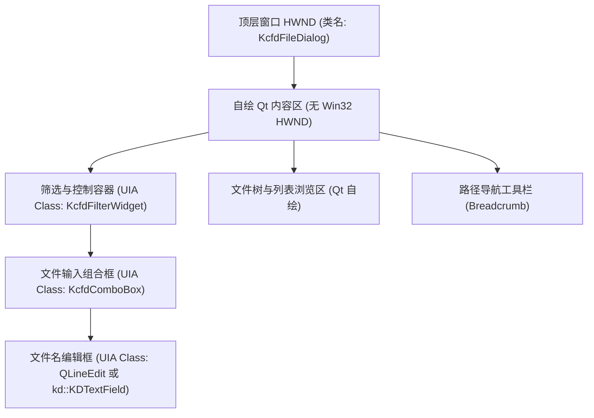
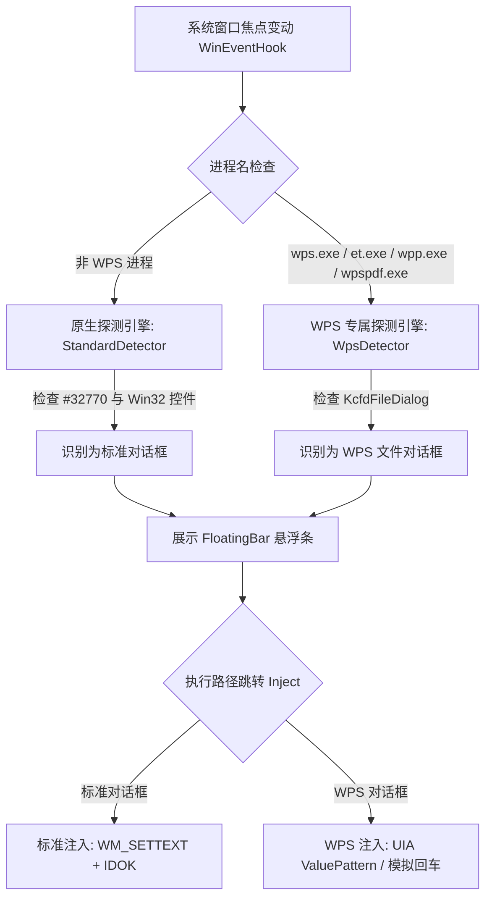

# QuickPath - WPS Office 另存为与打开对话框适配技术方案

---

## 1. 背景与现状分析

### 1.1 问题现象
- **现象 1**：在 WPS Office（包括 WPS 文字、WPS 表格、WPS 演示、WPS PDF）中触发“另存为”或“打开”时，QuickPath 的快速切换悬浮吸附条（FloatingBar）无法自动弹出，快捷键也无法唤起。
- **现象 2**：在 WPS 中按下 `F12` 键（传统 Office 中直接唤起系统原生另存为对话框的快捷键），无法调出 Windows 原生对话框，WPS 要么无响应，要么直接弹出自身内置的自绘窗口。

### 1.2 现状定性
在 Windows 平台上，绝大多数现代桌面应用（如 VS Code、Chrome、记事本、AutoCAD 等）均调用系统标准 API（`GetSaveFileName`、`GetOpenFileName` 或现代 COM 接口 `IFileDialog` / `IFileSaveDialog`），其顶层窗口类名为经典的 `#32770`。

然而，**现代 WPS Office（2019 / 2023 / 365 等全线版本）已彻底脱离 Windows 原生对话框体系**：
1. **去原生化**：WPS 基于 Qt 框架深度定制了自研 UI 引擎（KUI / KCore），所有文件保存与打开窗口均为基于 Qt 渲染的自绘窗口，已不再支持切回 Windows 原生 `#32770` 对话框；
2. **快捷键失效**：WPS 对 `F12`、`Ctrl + S` 等键盘事件进行了全局热键重映射，不会流转到系统的原生文件对话框调用层；
3. **结论**：**无法依赖用户端使用快捷键降级到系统原生对话框，QuickPath 必须从架构层对 WPS 自绘文件对话框进行原生支持。**

---

## 2. WPS 深度定制对话框底层剖析

经过对 WPS 进程特征与业界标杆（如 Listary 官方开源插件 `Listary.FileAppPlugin.WPS`）的底层比对分析，WPS 的文件对话框具有以下明确特征：

### 2.1 涉及的核心进程
| 进程名 | 对应组件 | 说明 |
| :--- | :--- | :--- |
| `wps.exe` | WPS 文字 / WPS 主程序 | 核心文字处理与通用主宿主 |
| `et.exe` | WPS 表格 | 对应 Excel |
| `wpp.exe` | WPS 演示 | 对应 PowerPoint |
| `wpspdf.exe` | WPS PDF | 独立 PDF 阅读与编辑 |
| `wpsoffice.exe` | WPS 启动台/聚合窗口 | 聚合中心（部分嵌入式另存为） |

### 2.2 窗口与控件层次结构


1. **顶层窗口类名**：
   - 现代版本统一为：**`KcfdFileDialog`**（即 Kingsoft Common File Dialog，金山通用文件对话框）。
   - 少数旧版或特定模块可能采用标准 Qt 类名（如 `Qt5QWindowIcon` / `QFileDialog`）。
2. **无 HWND 子控件（Windowless Controls）**：
   - Qt 等现代自绘框架内部的控件（如文本框、按钮、列表）**没有独立的 Win32 HWND 句柄**。
   - 使用 Win32 原生的 `EnumChildWindows` 或 `FindWindowEx` 无法枚举出内部输入框。
3. **UI Automation (UIA) 辅助功能树暴露**：
   - Qt 框架实现了完整的 Windows 辅助功能接口（通过 `QAccessibleInterface` 映射到 Windows UI Automation 树）。
   - 内部层级明确：
     - 容器控件：`KcfdFilterWidget`
     - 组合框控件：`KcfdComboBox`
     - 真正的输入框：`QLineEdit`（标准 Qt 单行编辑框）或 `kd::KDTextField`（金山自绘输入框），均实现了 UIA 的 `ValuePattern` 与 `TextPattern`。

---

## 3. QuickPath 当前架构的拦截盲区诊断

对照 QuickPath 现存代码实现，识别出以下三大核心拦截点：

### 3.1 拦截点一：探测器硬编码类名过滤 (`src/dialog/detector.rs`)
```rust
let class_name = get_window_class_name(hwnd);
// 大多数标准与通用文件对话框的类名均为 #32770
if class_name != "#32770" {
    return None;
}
```
* **问题**：WPS 窗口类名为 `KcfdFileDialog`，在此处首关直接被判定为非对话框而丢弃。

### 3.2 拦截点二：强制校验 Win32 原生控件特征 (`src/dialog/detector.rs`)
```rust
// 文件对话框必须同时满足两个必要条件：
// 1. 文件列表视图（DirectUIHWND / SHELLDLL_DefView）
// 2. 文件名输入组合框（ComboBoxEx32）
if !ctx.has_list_view || !ctx.has_file_name_combo {
    return None;
}
```
* **问题**：WPS 内部是 Qt 自绘，根本不存在 `DirectUIHWND` 和 `ComboBoxEx32`，子控件校验必然失败。

### 3.3 拦截点三：注入引擎依赖 Win32 标准消息 (`src/dialog/injector.rs`)
```rust
let _ = PostMessageW(
    Some(dialog_hwnd),
    windows::Win32::UI::WindowsAndMessaging::WM_COMMAND,
    WPARAM(1), // IDOK
    LPARAM(0),
);
```
* **问题**：对于 `KcfdFileDialog`，发送 Win32 `WM_COMMAND (IDOK)` 无法促使 Qt 视图导航；必须通过操作其文件名文本框并发送回车击键（`VK_RETURN`）触发内部路由。

---

## 4. 技术改造方案与架构设计

为确保 QuickPath 维持轻量、快速、零冗余的原则，同时完美兼容 WPS，采用 **“策略模式探测 + 轻量 UI Automation 辅助”** 的架构设计。



---

### 4.1 模块 1：扩展对话框探测器 (`src/dialog/detector.rs`)

将探测器逻辑升级为多引擎探测：
1. **进程预筛选（零开销过滤）**：
   - 获取当前窗口对应的进程名称。
   - 若进程属于 `["wps.exe", "et.exe", "wpp.exe", "wpspdf.exe"]`，分流至 `detect_wps_file_dialog`。
   - 其余进程继续走原有的极速 Win32 原生判断逻辑。
2. **WPS 专用探测器实现**：
   - 检查窗口类名是否为 `KcfdFileDialog`。
   - 验证窗口为可见状态，读取其窗口外接矩形 `RECT`。
   - 将 `FileDialogInfo` 的类型标志扩展（或设置标志位标记为 WPS 模式）。
   - **效果**：此时 QuickPath 悬浮吸附条（FloatingBar）即可立刻获得窗口尺寸并平滑吸附在 WPS 另存为窗口边缘！

### 4.2 模块 2：引入轻量级 UI Automation 封装 (`src/win32/uia.rs`)

利用 Windows 现有的 COM 接口直接与 UIA 通信，避免引入过重依赖：
1. **初始化 UIA 实例**：
   通过 `CoCreateInstance` 创建 `CUIAutomation`（系统全局接口，单例或按需初始化）。
2. **定位输入框元素**：
   ```rust
   // 伪逻辑示意：
   // 1. 从 HWND 获取 AutomationElement 根节点
   // 2. 搜索 ClassName 为 "KcfdFilterWidget" 的容器
   // 3. 搜索其子代 ClassName 为 "QLineEdit" 或 "kd::KDTextField"
   ```
3. **获取与赋值**：
   - 提取 `IUIAutomationValuePattern`（用于读取当前文件名与写入目标路径）。
   - 获取元素焦点（`SetFocus`）。

### 4.3 模块 3：适配路径注入引擎 (`src/dialog/injector.rs`)

针对 WPS 的特点，设计无缝平滑跳转序列：
1. **记录原始文件名**：
   通过 UIA ValuePattern 获取输入框内当前存在的文件名（如 `新建文本文档.docx`）。
2. **写入跳转目录**：
   将要切换的目标文件夹绝对路径（附加末尾反斜杠 `\`）写入文本框：
   ```rust
   value_pattern.SetValue(format!("{}\\", target_folder));
   ```
3. **触发目录重定向**：
   向输入框或窗口发送 `VK_RETURN`（回车键），Qt 对话框解析到该文本为有效目录，立即在主视图切换到该路径，并清空输入框。
4. **平滑还原文件名**：
   等待 100~200ms（等待 Qt 视图完成列目录），将第 1 步保存的原始文件名重新写入文本框，并执行全选，使用户可以无缝修改文件名并直接保存。

---

## 5. 代码实现示意（关键模块）

### 5.1 探测器改造 (`src/dialog/detector.rs`)
```rust
#[derive(Debug, Clone, Copy, PartialEq, Eq)]
pub enum DialogKind {
    StandardWin32,
    WpsOffice,
}

#[derive(Debug, Clone)]
pub struct FileDialogInfo {
    pub hwnd: HWND,
    pub process_id: u32,
    pub process_name: String,
    pub window_title: String,
    pub rect: RECT,
    pub file_name_edit_hwnd: Option<HWND>,
    pub kind: DialogKind,
}

pub fn detect_file_dialog(raw_hwnd: HWND) -> Option<FileDialogInfo> {
    unsafe {
        if !IsWindow(Some(raw_hwnd)).as_bool() {
            return None;
        }

        let (pid, process_name) = get_window_process_info(raw_hwnd);
        let lower_pname = process_name.to_lowercase();

        // 1. 优先检查是否为 WPS Office 进程
        if matches!(
            lower_pname.as_str(),
            "wps.exe" | "et.exe" | "wpp.exe" | "wpspdf.exe"
        ) {
            if let Some(info) = detect_wps_dialog(raw_hwnd, pid, process_name) {
                return Some(info);
            }
        }

        // 2. 回退走标准 Win32 #32770 探测逻辑
        detect_standard_win32_dialog(raw_hwnd, pid, process_name)
    }
}

fn detect_wps_dialog(hwnd: HWND, pid: u32, process_name: String) -> Option<FileDialogInfo> {
    unsafe {
        let class_name = get_window_class_name(hwnd);
        if class_name != "KcfdFileDialog" {
            return None;
        }

        if !IsWindowVisible(hwnd).as_bool() {
            return None;
        }

        let mut rect = RECT::default();
        let _ = GetWindowRect(hwnd, &mut rect);
        let window_title = get_window_title(hwnd);

        Some(FileDialogInfo {
            hwnd,
            process_id: pid,
            process_name,
            window_title,
            rect,
            file_name_edit_hwnd: None, // WPS 采用 UIA 操控，无单一 HWND
            kind: DialogKind::WpsOffice,
        })
    }
}
```

### 5.2 注入引擎改造 (`src/dialog/injector.rs`)
```rust
pub fn inject_path_to_wps_dialog(dialog_hwnd: HWND, target_path: &str) -> bool {
    let clean_path = target_path.trim().trim_end_matches('\\');
    if !std::path::Path::new(clean_path).is_dir() {
        return false;
    }
    let folder_with_slash = format!("{}\\", clean_path);

    // 调用 UIA 辅助模块写入并回车
    crate::win32::uia::wps_navigate_and_restore(dialog_hwnd, &folder_with_slash)
}
```

---

## 6. 实施路线与演进计划

| 阶段 | 目标 | 核心工作内容 | 预期产出 |
| :--- | :--- | :--- | :--- |
| **阶段 1** | 悬浮条即刻可见 (P0) | 1. 扩充 `detector.rs` 支持 `KcfdFileDialog` 类名识别<br>2. 悬浮条与候选目录在 WPS 另存为窗口立即弹出贴合 | 用户打开另存为能看到吸附条与历史/标签页目录 |
| **阶段 2** | UIA 定位输入框 (P1) | 1. 编写 `src/win32/uia.rs`，基于 `windows::Win32::UI::Accessibility` 调用 `IUIAutomation`<br>2. 准确定位 `QLineEdit` / `kd::KDTextField` 元素 | 能够在后台读取 WPS 当前文件名 |
| **阶段 3** | 无感跳转与秒切 (P0) | 1. 实现 ValuePattern 路径写入与回车提交<br>2. 异步延时（150ms）平滑恢复原文件名并高亮选区<br>3. 适配 AutoSwitch 自动秒切 | 点击吸附条或自动秒切能够直接改变 WPS 当前目录 |
| **阶段 4** | 边缘场景加固 (P2) | 1. 覆盖 WPS 表格（`et.exe`）、演示（`wpp.exe`）、PDF 等全部套件<br>2. 解决多显示器与高 DPI 缩放下的吸附坐标对齐 | 生产级稳定性交付 |

---

## 7. 总结

WPS Office 无法通过 `F12` 唤出原生对话框是其自身客户端架构演进的必然结果。通过**“策略化探测引擎”**识别 `KcfdFileDialog` 顶层窗口，并借助**“Windows 原生 UI Automation”**精准定位自绘输入框，QuickPath 可以彻底攻克以 WPS 为代表的现代自绘应用程序的路径跟随与快速跳转难题。
