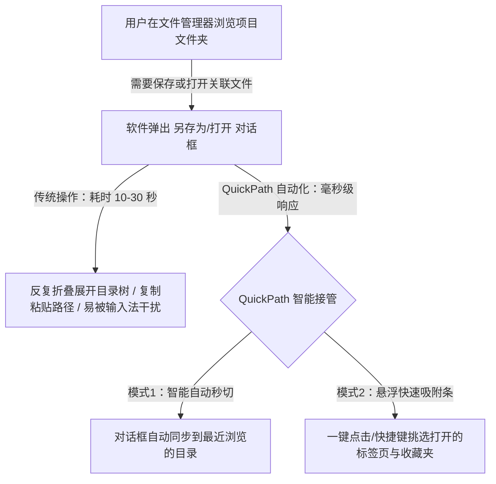
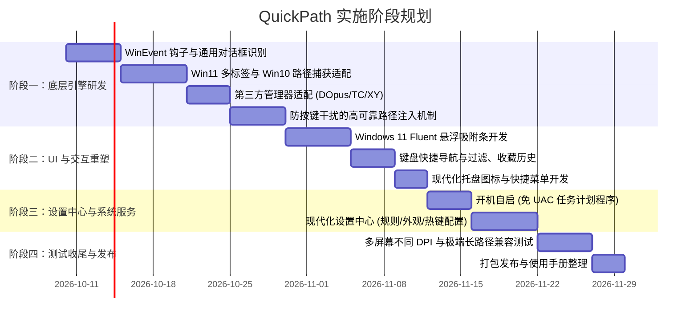

# QuickPath 产品需求文档 (PRD)

---

## 1. 文档概述

| 文档版本 | 状态 | 编写日期 | 目标平台 |
| :--- | :--- | :--- | :--- |
| **v1.0.0** | 正式规划 | 2026-10-05 | Windows 10 (1809+) / Windows 11 (全版本) |

### 1.1 项目背景
在日常桌面操作系统交互中，用户高频往返于**“文件管理器（如资源管理器、Directory Opus 等）”**与**“各类应用程序的打开/另存为文件对话框（Open / Save As Dialog）”**之间。
早期开源方案 `QuickSwitch`（基于 AHK v1 构建）初步实现了在文件对话框中获取外部文件管理器目录并切换的功能，但其存在以下典型缺陷：
1. **代码技术栈过时**：基于已被废弃的 AHK v1 编写，缺少现代多线程与健壮异常处理机制；
2. **Win11/Win10 兼容性断层**：
   - 无法有效适配 Windows 11 资源管理器的新特性（如多标签页 Tabs）；
   - 对现代通用对话框（IFileDialog / COM 架构）支持脆弱，采用暴力模拟击键（`Ctrl + L`、`EditPaste`、`Enter`），极易受到输入法顶词干扰与按键时序错乱影响；
   - 窗口层级计算（Z-Order Delta）死板，在多桌面、现代窗口层级下高频误判；
3. **视觉与交互极其老旧**：采用 Win32 原生土黄色菜单与生硬弹窗，与 Windows 11 现代 Fluent Design（Mica/Acrylic、圆角曲率、暗黑模式）严重脱节；
4. **功能简陋且设置缺失**：缺少开机自启（免 UAC 弹窗）、图形化配置中心、智能自动化跟随（AutoSwitch 过于机械）、路径收藏/历史记录、黑白名单管理等核心能力。

### 1.2 产品使命
**QuickPath** 旨在打造一款**轻量、极速、无感且符合 Windows 11/10 最新现代设计语言**的文件对话框智能路径跟随与快速跳转利器。让用户在进行文件“打开”、“保存”时，彻底告别在长层级目录树中反复寻找和复制粘贴路径的繁琐操作。

---

## 2. 用户痛点与核心价值



### 2.1 目标用户群
- **重度办公与开发人员**：频繁使用 IDE、文本编辑器、设计软件、浏览器保存/打开工程代码与资源资产；
- **数字资产创作者与设计师**：音视频剪辑师、3D 渲染师、Photoshop 用户，频繁在素材库与工程目录间交替；
- **效率工具重度爱好者**：Total Commander、Directory Opus、Listary 等经典效率工具的用户群体。

### 2.2 核心价值主张
1. **零学习成本与无感自动化**：无需刻意改变习惯，开箱即用，支持毫秒级静默自动跟随；
2. **现代 Windows 原生视觉**：完美融入 Windows 11/10 现代视觉体系（Fluent Design、Mica 材质、平滑微动效）；
3. **全生态兼容**：不仅支持原生资源管理器（含 Win11 标签页），还深度原生适配 Directory Opus、Total Commander、XYplorer、OneCommander、Files 等第三方主流文件管理器；
4. **极致稳定性与防干扰**：放弃脆弱的模拟击键注入，采用 API 优先 + 兜底隔离技术，绝不因输入法冲突产生乱码。

---

## 3. 功能特性全景规划

### 3.1 功能矩阵图谱

| 模块 | 核心功能 | 描述 | 优先级 |
| :--- | :--- | :--- | :--- |
| **智能路径捕获** | Windows 11 多标签页识别 | 准确获取活跃 Tab 的绝对路径，支持多窗口遍历 | P0 |
| | Windows 10 资源管理器识别 | 兼容单窗口经典 Explorer 实例 | P0 |
| | 第三方文件管理器适配 | Directory Opus、Total Commander、XYplorer、Files 等 | P1 |
| **无感自动秒切 (AutoSwitch)** | 智能焦点感知触发 | 从文件管理器切至对话框或反向切换时毫秒级自动切换 | P0 |
| | 黑白名单策略 | 针对浏览器、特定软件自定义自动同步策略 | P1 |
| | 异常防重入与状态回滚 | 对话框已被修改路径或输入文件名时不产生非预期覆盖 | P0 |
| **现代悬浮交互 (Floating Bar)** | Fluent 吸附悬浮条 | 贴合在文件对话框边缘或光标处，支持 Mica/Acrylic | P0 |
| | 键盘快速检索导航 | 支持拼音/字母即时过滤、上下键选择、Enter 确认 | P1 |
| | 常用收藏与历史记录 | 固定常用工作目录（Pinned），自动记录近期路径（LRU） | P1 |
| **路径安全注入引擎** | 多层级平滑注入 | 优先控件消息通讯，智能阻断输入法候选拦截 | P0 |
| | 长路径支持 (> 260 字符) | 解决传统 Win32 API MAX_PATH 截断问题 | P0 |
| **设置中心与系统服务** | 开机静默自启动 | 支持任务计划程序/注册表双模式，免 UAC 弹窗 | P0 |
| | 现代化系统托盘 | 托盘右键菜单、一键静音/暂停、直达设置与重启 | P0 |
| | 可视化设置面板 | 现代 WinUI 3 风格设置中心，支持快捷键自定义、外观切换 | P1 |

---

## 4. 详细功能需求说明

### 4.1 核心机制一：全平台文件管理器路径捕获引擎

#### 4.1.1 Windows 11 资源管理器（含多标签页 Tabs）适配
- **背景现状**：
  Win11 22H2 起引入标签页后，传统的 `Shell.Application.Windows` COM 接口在多 Tab 场景下只会返回首个标签页或主窗口句柄，无法准确判断当前激活的 Tab 路径。
- **技术需求**：
  1. 通过 Windows UI Automation (UIA) 或 `IShellWindows` + 遍历 `ShellTabWindowClass` 内部激活控件句柄；
  2. 获取当前前台处于选中态的 Tab 标题和对应绑定文档的 `IShellFolderViewDual` 路径；
  3. 过滤并剔除虚拟路径（如“此电脑”、“回收站”、“网络邻居”等无实际文件系统路径的特殊命名空间）。

#### 4.1.2 Windows 10 经典资源管理器适配
- 保留 `CabinetWClass` 与 `ExploreWClass` 窗口监控；
- 使用标准 COM 接口：`SHDocVw.ShellWindows` 快速枚举激活窗口的 `LocationURL` / `Folder.Self.Path`。

#### 4.1.3 第三方文件管理器扩展协议
系统设计插件式适配器模式（Adapter Pattern），便于随时扩展：
- **Directory Opus**：通过调用 `dopusrt.exe /info %TEMP%\dopusinfo.xml,paths` 或注册的 IPC 句柄，精准解析活动 Lister 与非活动 Lister 的当前路径；
- **Total Commander**：通过 Windows 消息 `WM_COPYDATA` 或向 `TTOTAL_CMD` 发送 `cm_CopySrcPathToClip` (2029) / `cm_CopyTrgPathToClip` (2030) 获取左右窗格路径，操作完毕瞬时还原用户剪贴板内容，不污染剪贴板历史；
- **XYplorer**：利用 XYplorer 的 `WM_COPYDATA` 脚本通信机制执行 `::copytext get('path', a);` 获取当前路径；
- **Files (WinUI 3 现代管理器)**：通过 UI Automation 抓取当前标签页地址栏信息或解析其 IPC 命名管道。

---

### 4.2 核心机制二：路径注入与对话框操控引擎 (Dialog Injector)

#### 4.2.1 对话框智能感知
- 监听系统级 `EVENT_SYSTEM_FOREGROUND` 和 `EVENT_OBJECT_CREATE`（通过轻量级 `SetWinEventHook`）；
- 毫秒级识别目标窗口是否为文件选择类对话框：
  - 传统对话框：`#32770` 窗口类，包含 `SysListView32` 或 `DirectUIHWND` + `ToolbarWindow32`；
  - 现代对话框：基于 `IFileDialog` 实现的窗口，包含 `Breadcrumb Parent`、`Address Band Root` 或 `NamespaceTreeControl`；
  - 忽略系统非文件弹窗（如普通 MessageBox、属性面板、运行对话框等）。

#### 4.2.2 健壮的防干扰注入机制
- **摒弃暴力模拟键鼠**：避免直接向窗口注入连续原始键盘敲击，防止被搜狗、微信、微软拼音等第三方输入法截获导致地址栏出现全拼汉字。
- **三层降级注入策略**：
  1. **层级 1 (API 直接注入)**：若为标准通用对话框，通过查找并锁定 `WorkerW -> ReBarWindow32 -> Address Band Root -> msctls_progress32 -> Breadcrumb Parent`，直接发送 Win32 消息（如 `WM_SETTEXT`）激活地址输入框并提交目标路径；
  2. **层级 2 (UI Automation 模式)**：定位地址栏的 ValuePattern 接口直接执行 `SetValue(targetPath)` 并调用 Invoke 发起导航；
  3. **层级 3 (安全模拟击键兜底)**：
     - 发送注入前临时调用 Windows API `ImmAssociateContext` 挂起当前控件的输入法（IME），或发送静默清除键；
     - 注入目标路径并回车确认；
     - 恢复光标焦点至原有的文件名输入框（`Edit1`），保留用户原先输入的文件名不变。

---

### 4.3 核心机制三：智能自动秒切 (AutoSwitch) 与规则系统

#### 4.3.1 自动秒切触发逻辑
- **从外部切入场景**：用户在文件管理器中点击了某目录，紧接着在应用中触发保存（或通过 `Alt + Tab` 切到对话框），系统判定上一个最常前台窗口为文件管理器，**0 延迟**自动将对话框切换至该目录。
- **多显示器/多窗口场景**：支持检测当前屏幕所包含的活跃管理器，或者依据时间戳最近（Most Recently Used, MRU）原则匹配目标路径。
- **安全性保护（防误触覆盖）**：
  - 若用户已经在对话框手动点击过浏览其他目录，或正在手动编辑路径，系统自动冻结自动覆盖机制，避免冲刷用户操作；
  - 提供单次撤销快捷键（如 `Ctrl + Z`），一键恢复对话框初始目录。

#### 4.3.2 灵活的规则过滤（黑/白名单）
在设置中允许为不同应用程序配置独立策略：
- **模式 A：完全自动 (Auto-Switch)**：检测到即自动跳转（默认对大部分文本编辑器、办公软件、图形软件生效）；
- **模式 B：仅悬浮提示 (Prompt Only)**：在对话框边缘微提示“切换至：D:\Projects”，点击或按 `Tab` 确认跳转；
- **模式 C：禁止接管 (Blacklist / Never)**：例如浏览器（自带各网站独立记住路径机制）、特定下载器等，完全静默不干扰。

---

### 4.4 核心机制四：现代悬浮交互栏 (Floating Bar)

#### 4.4.1 视觉风格定位
- **设计范式**：遵循 **Windows 11 Fluent Design System**；
- **视觉材质**：
  - Windows 11：支持 **Mica / Acrylic（亚克力模糊）** 材质，窗口边缘圆角（8px~12px），细微半透明磨砂边框与阴影；
  - Windows 10：自适应回退到经典亚克力模糊或极简扁平现代微阴影；
  - 自动跟随系统色彩模式（深色 Dark Mode / 浅色 Light Mode 自适应切换）。
- **无感吸附**：
  - 默认智能吸附在文件对话框的**底部边沿**或**顶部地址栏右侧**（用户可在设置中选择固定吸附或随光标弹出）；
  - 伴随对话框的移动与缩放自动贴合，对话框失焦/关闭时平滑淡出，不阻挡操作视野。

#### 4.4.2 悬浮栏内容与交互
1. **当前打开的路径列表**：清晰列出所有文件管理器窗口/Tab 的当前路径，并在右侧带有对应管理器的精美小图标（Explorer、DOpus、TC 等）；
2. **快速过滤与键盘直达**：
   - 呼出快捷键（默认 `Ctrl + Q` 或双击 `Ctrl`，可在设置中自由修改）；
   - 在悬浮条中支持键盘打字快速模糊搜索过滤；
   - 键盘 `↑` `↓` 切换选项，`Enter` 确认即刻完成对话框跳转；
3. **常用固定与历史目录**：
   - 支持将常用路径 Pin 到列表首位；
   - 自动展示最近使用过的 5 个历史路径（LRU 队列）。

---

### 4.5 核心机制五：系统服务、设置中心与托盘集成

#### 4.5.1 开机自启机制（免 UAC 弹窗设计）
许多工具开启自启时由于需要管理员权限会导致系统启动时弹出烦人的 UAC 提权确认框。QuickPath 规划提供**双模式**自启：
1. **标准用户自启**：写入注册表 `HKCU\Software\Microsoft\Windows\CurrentVersion\Run`；
2. **免 UAC 提权自启（推荐）**：自动在 Windows 任务计划程序（Task Scheduler）中注册一个开机以“最高权限（Highest Privileges）”静默自启的任务，彻底解决与以管理员权限运行的软件（如以管理员启动的 VSCode、Total Commander 等）通信问题，且系统开机零弹窗打扰。

#### 4.5.2 现代化系统托盘
- 常驻系统托盘区域，拥有原生适配的高清矢量图标（支持浅色/深色任务栏自适应图标反色）；
- **右键菜单功能**：
  - ⚡ **启用自动切换**（勾选/取消勾选）；
  - ⏸ **临时暂停 1 小时 / 恢复监听**；
  - ⚙ **打开设置中心**；
  - 🔄 **重新扫描文件管理器**；
  - ❌ **退出 QuickPath**。

#### 4.5.3 现代化图形设置中心 (Settings Hub)
采用类似 Windows 11 设置应用的左侧分类、右侧卡片式设计，支持：
1. **常规设置**：
   - 开机自启动开关（包含免 UAC 模式）；
   - 托盘图标显示；
   - 启动时最小化到托盘；
   - 语言切换（简体中文、English）。
2. **自动切换策略 (AutoSwitch)**：
   - 全局启用/关闭自动秒切；
   - 自动切换延迟灵敏度滑块（50ms ~ 500ms）；
   - 应用黑名单/白名单规则管理器（支持进程名、窗口标题模式匹配添加）。
3. **外观与交互**：
   - 主题切换：跟随系统 / 浅色模式 / 深色模式；
   - 材质特效：Mica 材质 / 亚克力 / 纯色极简；
   - 悬浮栏呼出快捷键（按键录制组件，防止热键冲突）；
   - 吸附位置偏好（吸附对话框底部 / 顶部 / 跟随光标弹出）。
4. **支持的文件管理器配置**：
   - 独立开启/关闭对 Windows 资源管理器、Directory Opus、Total Commander、XYplorer 等的识别检测；
   - 第三方管理器自定义可执行文件路径（如指定 dopusrt.exe 或 TC 路径）。
5. **关于与更新**：
   - 版本展示、开源许可协议、GitHub 自动检测更新。

---

## 5. 系统架构与关键技术选型

### 5.1 技术栈选型权衡评估

| 方案 | 优势 | 劣势 | 结论 |
| :--- | :--- | :--- | :--- |
| **方案 A：C# .NET 8 / 9 + WPF (Wpf.Ui) / WinUI 3** | - 原生契合 Windows 11 Fluent 规范与 Mica 材质<br>- COM / UIAutomation / PInvoke API 体系极其完善<br>- 开发效率高，易于长期维护与功能扩展 | - 需发布为自包含单文件（体积约 20~30MB 左右）或依赖 .NET Desktop Runtime | **【首选推荐】** 体验最佳，现代化程度最高 |
| **方案 B：Rust + Windows-rs + Slint / egui** | - 极致轻量（内存占用 < 10MB，体积 < 5MB）<br>- 无任何运行时依赖，开机秒启 | - 现代 Win11 亚克力与复杂多控件 UI 开发复杂度偏高 | **【候补方案】** 追求极致体积时的极佳选择 |
| **方案 C：AutoHotkey v2 重构** | - 脚本开发门槛低 | - 无法构建真正媲美系统级的 Fluent 现代 UI，高 DPI 及多线程易卡死 | **不予采纳** |

> **架构建议**：推荐采用 **C# (.NET 8 AOT / 独立发布) + WPF (结合 Wpf.Ui 现代 Fluent 库)**，在保证原生 Windows 11 视觉一致性、高稳定性与低内存占用的同时，最大化调用 Windows 现代 API。

### 5.2 核心模块架构分层

```
┌────────────────────────────────────────────────────────┐
│                   QuickPath 架构体系                   │
├────────────────────────────────────────────────────────┤
│  [UI 与展示层]                                         │
│  - Fluent 悬浮吸附条 (Mica/Acrylic / 动画 / 快捷键)     │
│  - 现代设置中心 (Wpf.Ui / MVVM / 暗黑模式)            │
│  - 现代化托盘图标与通知管理                             │
├────────────────────────────────────────────────────────┤
│  [核心调度与规则层]                                     │
│  - 焦点与事件调度总线 (Event Coordinator)               │
│  - 自动切换规则引擎 (AutoSwitch Rule Engine: 黑白名单)  │
│  - 历史记录 (LRU Cache) 与路径收藏夹存储               │
├────────────────────────────────────────────────────────┤
│  [底层检测与注入引擎]                                   │
│  - WinEventHook 窗口焦点与生命周期监听                  │
│  - Manager Adapters: Win11 Tab Explorer / DOpus / TC   │
│  - Dialog Injector: UIAutomation / Win32 消息安全注入   │
│  - 自动提权与任务计划程序管理 (Task Scheduler Service)  │
└────────────────────────────────────────────────────────┘
```

---

## 6. 非功能性需求与性能指标

### 6.1 性能要求
1. **超低资源占用**：
   - 后台静默待机时，CPU 占用率应接近 **0%**；
   - 内存常驻占用（Working Set）控制在 **30MB** 以内。
2. **响应极速**：
   - 对话框弹出到路径捕获并识别完毕的时间延迟小于 **80ms**；
   - 自动切换过程平滑无闪烁，无肉眼可感知的长时间卡顿。

### 6.2 兼容性与鲁棒性
1. **多显示器与不同 DPI 适配**：
   - 必须启用 `Per-Monitor V2 DPI Awareness`，在 100%、125%、150%、200% 混合多屏幕拖拽时，界面元素、图标与字体绝不模糊或错位；
2. **长路径支持**：
   - 在应用清单（App Manifest）中声明 `longPathAware`，完美支持超过 260 字符（`MAX_PATH`）的超长文件路径；
3. **鲁棒性防护**：
   - 第三方文件管理器未响应或进程异常退出时，QuickPath 绝不崩溃，具有超时自动熔断（Timeout Circuit Breaker）机制。

---

## 7. 实施路线图与里程碑拆解 (Milestones)



---

## 8. 总结与下阶段工作建议
本 PRD 彻底解决了旧版 `QuickSwitch` 代码陈旧、Win11 多标签失效、界面粗糙与自动化策略不足的痛点，提供了完整、严密的现代系统架构与产品规格。
下阶段可直接基于本文档确立的技术路线（推荐 C# .NET 8 + WPF 现代框架），建立工程结构并分步实施核心捕获与注入引擎。
